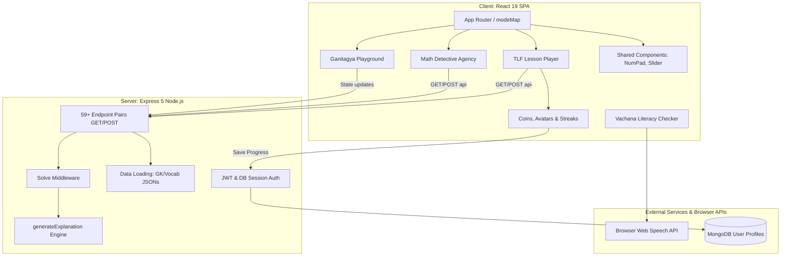

# Tenali — Product Specification & Software Requirements

> This document is a complete, formal specification of the Tenali educational quiz platform, amalgamating the high-level product vision with detailed functional requirements, validation rules, error handling, and test-ready acceptance criteria. An LLM given this document should be able to write the entire codebase from scratch.

---

## Table of Contents

1. [Product Overview (Vision & Journey)](#1-product-overview)
2. [Target Users & Personas](#2-target-users--personas)
3. [Success Metrics & Roadmap](#3-success-metrics--roadmap)
4. [System Architecture & Directory Structure](#4-system-architecture--directory-structure)
5. [Tech Stack & Dependencies & DB Schema](#5-tech-stack--dependencies)
6. [Core Technical Logic (Stateless Math Generator)](#6-core-technical-logic)
7. [Existing 69 Puzzle Types Registry](#7-existing-69-puzzle-types-registry)
8. [Feature Specification — Feature A: Tenali Learning Framework (TLF v1.0)](#feature-a-tenali-learning-framework-tlf-v1-0)
9. [Feature Specification — Feature B: Step-Wise Diagnostic Solving & Concept Visuals](#feature-b-step-wise-diagnostic-solving-concept-visuals)
10. [Feature Specification — Feature C: Avatar Builder & Coin Economy](#feature-c-avatar-builder-coin-economy)
11. [Feature Specification — Feature D: Level System with Regression](#feature-d-level-system-with-regression)
12. [Feature Specification — Feature E: Cohort-Scoped Leaderboards & Badging](#feature-e-cohort-scoped-leaderboards-badging)
13. [Feature Specification — Feature F: Parent Progress Digest](#feature-f-parent-progress-digest)
14. [Feature Specification — Feature G: Foundational Literacy & Comprehension Module (Vachana)](#feature-g-foundational-literacy-comprehension-module-vachana)
15. [Feature Specification — Feature H: Math Detective Agency (MDA)](#feature-h-math-detective-agency-mda)
16. [Feature Specification — Feature I: Ganitagya Math Playground (Interactive Widget Engine)](#feature-i-ganitagya-math-playground-interactive-widget-engine)
17. [Feature Specification — Feature J: Themed Onboarding & Mascot Reskinning](#feature-j-themed-onboarding-mascot-reskinning)
18. [Feature Specification — Feature K: Themed Adventure Map with Fog of War](#feature-k-themed-adventure-map-with-fog-of-war)
19. [Feature Specification — Feature L: Spaced Revision System](#feature-l-spaced-revision-system)
20. [Feature Specification — Feature M: Be the Teacher Diagnostic Mode](#feature-m-be-the-teacher-diagnostic-mode)
21. [Feature Specification — Feature N: Self-Racing Ghost Mode](#feature-n-self-racing-ghost-mode)
22. [Feature Specification — Feature O: Misconception Monsters & Hall of Silly Mistakes](#feature-o-misconception-monsters-hall-of-silly-mistakes)
23. [Feature Specification — Feature P: Prerequisite Auto-Routing & Warmups](#feature-p-prerequisite-auto-routing-warmups)
24. [Feature Specification — Feature Q: Knowledge Multiverse & Evolution Companion](#feature-q-knowledge-multiverse-evolution-companion)
25. [Feature Specification — Feature R: Curiosity & Confidence Meter](#feature-r-curiosity-confidence-meter)
26. [Feature Specification — Feature S: Bayesian Knowledge Tracing (BKT) Adaptive Engine](#feature-s-bayesian-knowledge-tracing-bkt-adaptive-engine)
27. [Feature Specification — Feature T: Dyslexia-Friendly & Low-Vision Interface](#feature-t-dyslexia-friendly-low-vision-interface)
28. [Feature Specification — Feature U: i18n Multilingual Interface](#feature-u-i18n-multilingual-interface)
29. [Feature Specification — Feature V: Session Time Optimizer & Study Planners](#feature-v-session-time-optimizer-study-planners)
30. [Feature Specification — Feature W: Solve Streak & Journey Session Recap](#feature-w-solve-streak-journey-session-recap)
31. [Feature Specification — Feature X: Explain It Differently Engine](#feature-x-explain-it-differently-engine)
32. [Feature Specification — Feature Y: Local-First Synchronization Engine](#feature-y-local-first-synchronization-engine)
33. [Feature Specification — Feature Z: Printable Worksheet Generator](#feature-z-printable-worksheet-generator)
34. [Feature Specification — Feature AA: Mistake Journal](#feature-aa-mistake-journal)
35. [Feature Specification — Feature AB: XP Hint Economy & Progressive Hints](#feature-ab-xp-hint-economy-progressive-hints)
36. [Feature Specification — Feature AC: Learning Transfer Challenges](#feature-ac-learning-transfer-challenges)
37. [Feature Specification — Feature AD: Multi-Concept Problem Generator](#feature-ad-multi-concept-problem-generator)
38. [Feature Specification — Feature AE: Explain My Mistake Divergence Engine](#feature-ae-explain-my-mistake-divergence-engine)
39. [Feature Specification — Feature AF: Daily Streak Tracker](#feature-af-daily-streak-tracker)
40. [Feature Specification — Feature AG: Cosmetic Reward Shop & Sun Coins](#feature-ag-cosmetic-reward-shop-sun-coins)
41. [Feature Specification — Feature AH: Learn Before You Test (Concept-First Path)](#feature-ah-learn-before-you-test-concept-first-path)
42. [Feature Specification — Feature AI: Curiosity Mode (What-If Equation Sandbox)](#feature-ai-curiosity-mode-what-if-equation-sandbox)
43. [Feature Specification — Feature AJ: Adaptive Mixed Practice (Interleaved Quizzes)](#feature-aj-adaptive-mixed-practice-interleaved-quizzes)
44. [Feature Specification — Feature AK: Concept Health Decay Engine](#feature-ak-concept-health-decay-engine)
45. [Feature Specification — Feature AL: Learning Checkpoints (Milestone Gating)](#feature-al-learning-checkpoints-milestone-gating)
46. [Feature Specification — Feature AM: Smart Frustration & Pause Detection](#feature-am-smart-frustration-pause-detection)
47. [Feature Specification — Feature AN: Goal-Based Practice Sessions](#feature-an-goal-based-practice-sessions)
48. [Feature Specification — Feature AO: Self-Progress Analytics Dashboard](#feature-ao-self-progress-analytics-dashboard)
49. [Feature Specification — Feature AP: Drag-Tile Answer Input (Tactile Interface)](#feature-ap-drag-tile-answer-input-tactile-interface)
50. [Feature Specification — Feature AQ: Tap-to-Define Word Glossary](#feature-aq-tap-to-define-word-glossary)
51. [Feature Specification — Feature AR: Rewind-Not-Wrong CSS Animation](#feature-ar-rewind-not-wrong-css-animation)
52. [Feature Specification — Feature AS: Open-Ended Strategy Puzzles](#feature-as-open-ended-strategy-puzzles)
53. [Feature Specification — Feature AT: Audio Jingle Mnemonic Hooks](#feature-at-audio-jingle-mnemonic-hooks)
54. [Feature Specification — Feature AU: AI Study Session Planner](#feature-au-ai-study-session-planner)
55. [Feature Specification — Feature AV: Achievement Collections](#feature-av-achievement-collections)
56. [Feature Specification — Feature AW: Concept Connections graph widgets](#feature-aw-concept-connections-graph-widgets)
57. [Feature Specification — Feature AX: Adaptive Reading Levels](#feature-ax-adaptive-reading-levels)
58. [Feature Specification — Feature AY: Interactive Formula Explorer](#feature-ay-interactive-formula-explorer)
59. [Feature Specification — Feature AZ: Profile Achievement Showcase](#feature-az-profile-achievement-showcase)
60. [Feature Specification — Feature BA: Daily Mission Checklists](#feature-ba-daily-mission-checklists)
61. [Feature Specification — Feature BB: Focus Mode](#feature-bb-focus-mode)
62. [Feature Specification — Feature BC: Conceptual Multiple-Choice Variants](#feature-bc-conceptual-multiple-choice-variants)
63. [Feature Specification — Feature BD: Find the Mathematical Error](#feature-bd-find-the-mathematical-error)
64. [Feature Specification — Feature BE: Mad-Libs Style Story Customization](#feature-be-mad-libs-style-story-customization)
65. [Feature Specification — Feature BF: Integrated "Did You Know?" Concept Cards](#feature-bf-integrated-did-you-know-concept-cards)
66. [Feature Specification — Feature BG: Cohort Progress and Struggle Heatmap](#feature-bg-cohort-progress-and-struggle-heatmap)
67. [Feature Specification — Feature BH: Class-Wide Concept Difficulty Index](#feature-bh-class-wide-concept-difficulty-index)
68. [Feature Specification — Feature BI: Classroom Cooperative Goals](#feature-bi-classroom-cooperative-goals)
69. [Feature Specification — Feature BJ: Streak Calendar Heatmap](#feature-bj-streak-calendar-heatmap)
70. [Feature Specification — Feature BK: Quick-Reference Cheat Card](#feature-bk-quick-reference-cheat-card)
71. [Feature Specification — Feature BL: Bookmark a Question/Story](#feature-bl-bookmark-a-questionstory)
72. [Feature Specification — Feature BM: Light Weekly Teacher Digest](#feature-bm-light-weekly-teacher-digest)
73. [Feature Specification — Feature BN: GeoGebra Integration](#feature-bn-geogebra-integration)
74. [Feature Specification — Feature BO: Project Engine](#feature-bo-project-engine)
75. [Feature Specification — Feature BP: Community Learning Hub](#feature-bp-community-learning-hub)
76. [Feature Specification — Feature BQ: Mathematical Search & Discovery Engine](#feature-bq-mathematical-search--discovery-engine)
77. [Feature Specification — Feature BR: Notification Engine](#feature-br-notification-engine)
78. [Feature Specification — Feature BS: Educational Content Management System (CMS)](#feature-bs-educational-content-management-system-cms)
79. [Feature Specification — Feature BT: Platform Administration Portal](#feature-bt-platform-administration-portal)
80. [Feature Specification — Feature BU: Balance Scale (Drag-and-Drop Physics Puzzle)](#feature-bu-balance-scale)
81. [Feature Specification — Feature BV: Visual Counting (Drag-and-Drop Apple Basket)](#feature-bv-visual-counting)
82. [Feature Specification — Feature BW: Dart Board (Coordinate-Plane Plotting Game)](#feature-bw-dart-board)
83. [Feature Specification — Feature BX: GymApp (Multi-Skill Adaptive Cross-Training)](#feature-bx-gymapp)
84. [Feature Specification — Feature BY: Algebra Drill (Rendered Math as Answer Choices)](#feature-by-algebra-drill)
85. [Feature Specification — Feature BZ: Guess-the-Number (Binary-Logic Magic Trick)](#feature-bz-guess-the-number)
86. [Feature Specification — Feature CA: Concept Matching (Cross-Domain MCQ Pipeline)](#feature-ca-concept-matching)
87. [Feature Specification — Feature CB: Tenth Curriculum (24-Chapter Structured Course)](#feature-cb-tenth-curriculum)
88. [Feature Specification — Feature CC: AI Mentor Personalities (Custom Socratic Explanations)](#feature-cc-ai-mentor-personalities)
89. [Feature Specification — Feature CD: Certificate Generator with QR Verification](#feature-cd-certificate-generator)
90. [Feature Specification — Feature CE: AI Notes Generator & Flashcard Exporter](#feature-ce-ai-notes-generator)
91. [Feature Specification — Feature CF: Auditory Gamification (BGM & SFX Layer)](#feature-cf-auditory-gamification)
92. [Feature Specification — Feature CG: Advanced XP & Leveling Engine](#feature-cg-advanced-xp--leveling-engine)
93. [Feature Specification — Feature CI: Fraction Simulator](#feature-ci-fraction-simulator)
94. [Feature Specification — Feature CJ: Interactive Number Line Simulator](#feature-cj-interactive-number-line-simulator)
95. [Feature Specification — Feature CK: Study Pomodoro Timer](#feature-ck-study-pomodoro-timer)
96. [Feature Specification — Feature CL: AI Learning Reflection](#feature-cl-ai-learning-reflection)
97. [Feature Specification — Feature CM: Concept Evolution Timeline](#feature-cm-concept-evolution-timeline)
98. [Feature Specification — Feature CR: Curated Real-World Math Pathways](#feature-cr-curated-math-pathways)
99. [Feature Specification — Feature CS: Tamil Localization Support](#feature-cs-tamil-localization-support)
100. [Feature Specification — Feature CT: Reflection Journal & Inert Wall](#feature-ct-reflection-journal)
101. [Feature Specification — Feature CU: Curated Open-Source Study Resources](#feature-cu-curated-study-resources)
102. [Feature Specification — Feature CV: Word Problem Reading Comprehension Checks](#feature-cv-reading-comprehension-checks)
103. [Feature Specification — Feature CW: Concept Relevance Opener ("A World Without Me")](#feature-cw-concept-relevance-opener)
104. [Feature Specification — Feature CX: Comic Cast Word Problems](#feature-cx-comic-cast-word-problems)
105. [Feature Specification — Feature CY: Cliffhanger Story Unlocks](#feature-cy-cliffhanger-story-unlocks)
106. [Feature Specification — Feature CZ: "Predict the Panel" Conceptual Prediction Checks](#feature-cz-predict-the-panel)
107. [Feature Specification — Feature DB: Gradual Release Scaffolding](#feature-db-gradual-release-scaffolding)
108. [Feature Specification — Feature DC: Teach It Back (Feynman Technique)](#feature-dc-teach-it-back)
109. [Feature Specification — Feature DD: Contrast Challenge](#feature-dd-contrast-challenge)
110. [Feature Specification — Feature DE: Bridge Cards](#feature-de-bridge-cards)
111. [Feature Specification — Feature DF: Daily Bonus Puzzle](#feature-df-daily-bonus-puzzle)
112. [Feature Specification — Feature DG: Interactive Mascot Quiz Reactions](#feature-dg-interactive-mascot-quiz-reactions)
113. [Feature Specification — Feature DH: Data Science & Statistics Foundations Modules](#feature-dh-data-science--statistics-foundations-modules)
114. [Feature Specification — Feature DI: Tenali Mind Reader Game (Akinator-style Concept Guesser)](#feature-di-mind-reader)
115. [Prerequisite Graph & Path Journey](#115-prerequisite-graph--path-journey)

---

## 1. Product Overview

### Vision
Tenali exists to shift math learning from passive memorization to interactive discovery. It is not merely an assessment tool; it is a living, breathing learning world where mastering mathematical concepts builds a student's personal learning identity.

### Problem Statement
Standard ed-tech platforms serve flat, repetitive MCQ drills that encourage guessing and offer no step-by-step diagnostic feedback. Because there is no progress tracking, personalization, or persistent rewards, students experience cognitive overload and have no intrinsic motivation to return to the site the next day.

---

## 2. Target Users & Personas

* **Taittiriya (Student, Age 10–12)**: Needs high visual feedback, micro-rewards (coins/avatars), and gentle scaffolding to avoid math anxiety.
* **Tatsavit (Student, Age 13–16)**: Preparing for board exams (CBSE/ICSE) where step-wise marks are awarded. Needs step-by-step diagnostic feedback to target specific weak spots.
* **Classroom Teacher**: Wants to manage student cohorts and see consistency/effort rankings without creating high-pressure environments.
* **Parent**: Desires periodic, high-level digests showing where their child is struggling or succeeding, without micro-surveilling their screen time.

---

## 3. Success Metrics & Roadmap

### Success Metrics
* **Engagement**: Weekly active streak retention rate.
* **Concept Mastery**: The ratio of completed Stage 3 (Mastery) topics relative to starts.
* **Scaffolding Efficacy**: Decrease in student error rates on checkable steps after triggering a step-wise diagnostic walkthrough.

### In Scope
* 69 math and verbal topics with adaptive generation.
* Localized localStorage persistence for theme and progression state.
* Core interactive avatar customizing panel and coin rules.
* Dijkstra-based prerequisite journey planner.

### Out of Scope
* Video streaming or video-based lectures.
* Real-time synchronous multiplayer games (lobbying is asynchronous/cohort-scoped).
* Real-time active screen surveillance dashboards for parents.

---

## 4. System Architecture & Directory Structure

### System Architecture Diagram


### Directory Structure
```
Tenali/
├── server/
│   ├── package.json          # Express server configuration
│   └── index.js              # Monolithic Express file (API router + static server)
├── client/
│   ├── package.json          # React client dependencies
│   ├── vite.config.js        # Vite proxy configuration
│   ├── src/
│   │   ├── main.jsx          # React app entry point
│   │   ├── App.jsx           # Monolithic React UI components and routing
│   │   ├── App.css           # CSS variables, typography, and theme definitions
│   │   └── index.css         # Reset styles
│   └── dist/                 # Static production bundle target
├── chitragupta/
│   └── questions/            # 991 GK questions (JSON format)
├── vocab/
│   └── questions/            # 7,662 vocabulary questions (JSON format)
├── graph/
│   ├── index.html            # Prerequisite DAG page (D3 + Dagre)
│   └── path.html             # Path finder quiz interface
└── render.yaml               # Build command: npm install && cd client && npm install && npm run build
```

---

## 5. Tech Stack & Dependencies & DB Schema

### Server (`server/package.json`)
* **Framework**: Node.js & Express 5.x.
* **Database**: MongoDB (backed by JWT Auth) with inline memory fallbacks for fallback seed users.
* **Dependencies**: `cors`, `express`, `http-proxy-middleware`.

### Client (`client/package.json`)
* **Framework**: React 19.x (Built using Vite).
* **Dependencies**: `axios`, `react`, `react-dom`.
* **Dev Dependencies**: `@vitejs/plugin-react`, `vite`, `eslint`.

### Database Schema & Document Models (MongoDB)

To prevent LLM generation ambiguity, all databases, collections, and document keys must strictly implement the following schemas:

#### 1. `users` Collection
Tracks authentication, coin balance, study consistency, and avatar customizations:
```json
{
  "_id": "ObjectId",
  "username": "String (required, unique, trimmed)",
  "passwordHash": "String (required)",
  "email": "String (optional, unique, RFC 5322 valid)",
  "parentEmail": "String (optional, defaults to null)",
  "coins": "Integer (required, >= 0, default: 0)",
  "xp": "Integer (required, default: 0)",
  "onboardingTheme": "String (enum: ['superheroes', 'space', 'jungle', 'fantasy'], default: null)",
  "streak": "Integer (required, >= 0, default: 0)",
  "lastActiveDate": "ISODate (default: null)",
  "streakFreezeCount": "Integer (required, default: 0)",
  "avatar": {
    "equipped": {
      "hairstyle": "String (default: 'default')",
      "outfit": "String (default: 'default')",
      "accessory": "String (default: 'default')",
      "background": "String (default: 'default')",
      "expression": "String (default: 'neutral')"
    },
    "purchasedAccessories": ["String"]
  },
  "completedTopics": ["String"],
  "optInLeaderboard": "Boolean (default: false)"
}
```

#### 2. `cohorts` Collection
Links classrooms and manages consistency points (CP) for weekly ranking resets:
```json
{
  "_id": "ObjectId",
  "className": "String (required)",
  "teacherId": "ObjectId (required)",
  "students": ["ObjectId"],
  "weeklyCP": [
    {
      "studentId": "ObjectId",
      "points": "Integer (default: 0)",
      "streakLength": "Integer (default: 0)",
      "levelsCompleted": "Integer (default: 0)"
    }
  ],
  "weekStartingDate": "ISODate (required)"
}
```

#### 3. `detective_cases` Collection
Defines story briefs, math clues, and suspects for mystery-solving:
```json
{
  "_id": "ObjectId",
  "theoremKey": "String (required, indexed)",
  "caseTitle": "String (required)",
  "briefingText": "String (required)",
  "clues": [
    {
      "clueId": "String (required)",
      "description": "String (required)",
      "mathHintCode": "String (corresponds to step-wise math results)"
    }
  ],
  "suspects": [
    {
      "suspectId": "String (required)",
      "name": "String (required)",
      "alibiText": "String (required)",
      "isCulprit": "Boolean (required)"
    }
  ]
}
```

#### 4. `student_case_progress` Collection
Tracks unlocked evidence and solved status of Math Detective Agency cases:
```json
{
  "_id": "ObjectId",
  "studentId": "ObjectId (required, indexed)",
  "caseId": "ObjectId (required, indexed)",
  "unlockedClues": ["String"],
  "eliminatedSuspects": ["String"],
  "accusedSuspectId": "String (default: null)",
  "justificationText": "String (default: null)",
  "status": "String (enum: ['in-progress', 'solved'], default: 'in-progress')",
  "solvedAt": "ISODate (default: null)"
}
```

#### 5. `student_attempt_logs` Collection
Records detailed keystrokes, timings, and hint clicks for parent digests:
```json
{
  "_id": "ObjectId",
  "studentId": "ObjectId (required, indexed)",
  "topicKey": "String (required, indexed)",
  "timestamp": "ISODate (required)",
  "questionPrompt": "String (required)",
  "userInput": "String (required)",
  "confidence": "String (enum: ['Sure', 'Unsure', 'Guessing'], required)",
  "correct": "Boolean (required)",
  "hintsClickedCount": "Integer (required, >= 0)",
  "timeSpentSeconds": "Integer (required, >= 0)",
  "stageNumber": "Integer (required, range: 1-3)"
}
```

---

## 6. Core Technical Logic (Stateless Math Generator)

### Stateless Math Generator
Except for static GK/Vocab JSON assets loaded into memory at server startup, the server dynamically generates math questions on every `GET /<type>-api/question` request using randomized multipliers. The difficulty parameter (0 = Easy, 1 = Medium, 2 = Hard, 3 = Extra Hard) drives the numeric ranges (e.g. `digitRange` or `quadraticRange`).

### Express Solve Middleware
Intercepts all `POST *-api/check` endpoints. If `req.body.solve === true`, the middleware intercepts and monkey-patches `res.json` to attach a step-by-step markdown-based explanation generated dynamically by `generateExplanation()`.

---

## 7. Existing 69 Puzzle Types Registry

The application supports the following 69 distinct topics mapped inside `modeMap` and serving GET/POST API endpoints:
- **Arithmetic**: `addition`, `basicarith`, `multiply`, `decimals`, `fractionadd`, `percent`, `ratio`, `rounding`, `sqrt`, `squaring`
- **Number Theory**: `hcflcm`, `primefactor`, `bases`
- **Algebra**: `indices`, `surds`, `lineareq`, `quadratic`, `qformula`, `simul`, `funceval`, `lineq`, `polymul`, `polyfactor`, `sequences`, `ineq`, `binomial`, `remfactor`, `variation`, `stdform`, `bounds`, `log`, `complex`
- **Geometry**: `trig`, `invtrig`, `coordgeom`, `angles`, `triangles`, `congruence`, `pythag`, `polygons`, `similarity`, `circleth`, `bearings`, `mensur`, `heron`, `circmeasure`, `conics`, `transform`, `section`
- **Calculus**: `diff`, `integ`, `limits`, `diffeq`
- **Statistics & Probability**: `prob`, `stats`, `permcomb`
- **Vectors & Matrices**: `matrix`, `vectors`, `dotprod`
- **Applied Math**: `sdt`, `profitloss`, `shares`, `banking`, `gst`, `linprog`
- **Other**: `gk`, `vocab`, `spot` (Twin Hunt), `tatsavit` (9-level drill)

---

## Feature A: Tenali Learning Framework (TLF v1.0)

### Description
Every lesson is structured as a short learning journey rather than a sequence of flat questions. It introduces concepts one step at a time, minimizing cognitive load and promoting active visual prediction.

### Functional Requirements
* **FR-A1**: The lesson player must structure lessons into a linear sequence of steps mapping to the 13 TLF components:
  1. *Ever Wondered?* (Curiosity hook question)
  2. *Why This Matters* (One-sentence utility justification)
  3. *Today's Mission* (Checklist of objectives)
  4. *Quick Recall* (1–2 ungraded prerequisite review questions)
  5. *Prediction* (Ungraded hypothesis question; no marks)
  6. *Learn One Small Idea* (Concept slide fitting on a single screen)
  7. *Guided Example* (A simple step-by-step worked problem)
  8. *Try It* (1–3 practice questions immediately following the idea)
  9. *Checkpoint* (Visual indicator celebrating milestones)
  10. *Challenge* (Independent quiz using Tenali's algorithmic question generator)
  11. *Tenali's Tidbit* (Under 40-word fun history or real-world trivia)
  12. *Reflection* (Self-reflective questions e.g. "What pattern did you notice?")
  13. *Mission Complete* (Summary screen unlocking the next lesson)
* **FR-A2**: The interface must support four core flows:
  * **Discovery-Heavy**: Focuses on *Ever Wondered*, *Prediction*, *Learn*, *Question*, *Learn*, *Challenge*.
  * **Skill-Heavy**: Focuses on *Quick Recall*, *Mission*, *Learn*, *Guided Practice*, *Challenge*, *Reflection*.
  * **Revision**: Focuses on *Mission*, *Quick Recall*, *Challenge*, *Reflection*, *Tidbit*.
  * **Puzzle**: Focuses on *Puzzle*, *Student Guesses*, *Reveal*, *Practice*, *Hard Puzzle*.

### Validation
* Lesson flow configuration objects must contain at least three stages.

### Errors
* **400 Bad Request**: If a lesson payload lacks mandatory steps or uses unregistered components.

### Acceptance Criteria
```gherkin
Scenario: A student starts a fractions lesson in Discovery-heavy mode
  Given the student selects the fractions lesson
  When the lesson starts
  Then the student is presented with the "Ever Wondered" question: "Can two people both get more than half of a pizza?"
  And no feedback or grade is recorded for their answer at this stage.
```

---

## Feature B: Step-Wise Diagnostic Solving & Concept Visuals

### Description
Trains students in the CBSE/ICSE step-marking style. Instead of displaying a static correct answer when a student fails a multi-step problem, the system breaks the question down into its sub-components, checking the student's work step-by-step.

### Functional Requirements
* **FR-B1**: Multi-step questions (defined as questions with >= 2 decision points) must enter **Diagnostic Mode** on the student's first incorrect submission.
* **FR-B2**: In Diagnostic Mode, the primary question text is replaced by a sequence of sub-step inputs.
* **FR-B3**: The system must check each step instantly:
  * If correct: Enable input for the next step.
  * If incorrect: Display the correct working/method for *that step only*, then let the user proceed to the next step.
* **FR-B4**: After all steps are solved or corrected, display the full start-to-finish recap.
* **FR-B5**: The overall question must still be scored as **Incorrect** (preventing users from laundering errors into a passed grade).

### Validation
* Step inputs must accept decimal values, fractional slashes (/), negative signs, and variable x.

### Errors
* **422 Unprocessable Entity**: Invalid characters or syntax in formula inputs.

### Acceptance Criteria
```gherkin
Scenario: Student enters incorrect answer on a 2-step algebraic equation
  Given the student is solving "3(x + 2) = 21"
  When they submit the incorrect answer "5"
  Then the input box disappears and step-wise inputs are displayed
  And Step 1 asks the student to expand: "3x + 6 = ?"
```

---

## Feature C: Avatar Builder & Coin Economy

### Description
Students earn virtual coins by completing math topics and maintaining study consistency. Earned coins can be spent in the Avatar Builder to purchase accessories and unlock functional, in-game advantages (Superpowers).

### Functional Requirements
* **FR-C1**: Every student starts with a default featureless, grey avatar.
* **FR-C2**: Coins must be credited to the user's account using the following base rules:
  * Complete Stage 1 of any topic: +10 coins
  * Complete Stage 2: +20 coins
  * Complete Stage 3 (Mastery): +50 coins
  * Maintain a 7-day streak: +30 bonus coins
  * Question answered correctly on the first attempt (no hints used): +5 bonus coins
* **FR-C3**: Avatars must be customizable using coins across five categories: Hairstyle, Outfit, Accessories, Background, and Expression.
* **FR-C4**: Avatar progress must drive **Avatar Strength**, measured by the total number of unique topics completed.
* **FR-C5**: Unlock **Superpowers** based on Avatar Strength thresholds:
  * **Explorer Avatar (11–25 topics)**: Shield (ignores 1 wrong answer in a level) and Hint Boost (upgrades hints).
  * **Warrior Avatar (26–40 topics)**: Time Freeze (adds 10 seconds to any challenge) and Second Chance (instantly retry failed level).
  * **Master Avatar (41+ topics)**: Streak Guard (safeguards streak if a day is missed).

### Validation
* Coin balances must never fall below zero.

### Errors
* **403 Forbidden**: Attempting to equip an item or use a superpower before unlocking the required threshold.

### Acceptance Criteria
```gherkin
Scenario: Student completes a mastery stage with no hints
  Given a student has 100 coins
  When they successfully complete Stage 3 of "Trigonometry" on the first try
  Then their coin balance increases by 55 coins
```

---

## Feature D: Level System with Regression

### Description
Replaces flat quizzes with a structured 3-stage difficulty ladder. Students must earn progression through accuracy while wrong answers trigger hints or regression to the previous stage.

### Functional Requirements
* **FR-D1**: Every topic must maintain three distinct stages: Stage 1 (Beginner), Stage 2 (Intermediate), and Stage 3 (Advanced/Mastery).
* **FR-D2**: Progression Rules:
  * **3 Correct Answers in a Row**: Advance to the next stage.
  * **1 Wrong Answer**: Show a detailed diagnostic hint. The student remains in the current stage.
  * **3 Wrong Answers in a Stage**: Regress the student to the previous stage.
* **FR-D3**: Regression results in zero coins earned for the current stage session.
* **FR-D4**: Completing all 3 stages marks the topic as **Mastered** on the dashboard.

### Validation
* Streak counters must reset to 0 when a wrong answer is submitted.
* Regression cannot occur below Stage 1.

### Errors
* **400 Bad Request**: Requesting a quiz question for an invalid stage number.

### Acceptance Criteria
```gherkin
Scenario: Student gets three correct answers in a row on Stage 1
  Given a student is at Stage 1 of a topic with a correct streak of 2
  When they submit a correct answer to the next question
  Then they are promoted to Stage 2
```

---

## Feature E: Cohort-Scoped Leaderboards & Badging

### Description
An opt-in classroom-level engagement tracker that ranks students by effort and consistency rather than raw completion speed, protecting slower students from discouragement.

### Functional Requirements
* **FR-E1**: Leaderboards must be scoped to the classroom/cohort level (no global leaderboards).
* **FR-E2**: The system must rank students based on **Consistency Points (CP)** earned during the active week:
  * CP = (Current Streak * 10) + (Levels Completed * 5) + (Modules Mastered * 50).
  * Raw speed, response time, or first-place completion counts must never influence the ranking.
* **FR-E3**: Leaderboards must be **strictly opt-in**. If a student does not opt-in, their name and avatar do not appear.

### Validation
* CP scores must reset at 00:00 UTC every Sunday.

### Errors
* **401 Unauthorized**: Attempting to view the leaderboard without active login credentials.

### Acceptance Criteria
```gherkin
Scenario: Student opts out of leaderboard visibility
  Given a student has set their leaderboard preference to "Opt-out"
  When another member of the same cohort views the leaderboard
  Then the opted-out student's name, avatar, and CP scores are not visible.
```

---

## Feature F: Parent Progress Digest

### Description
Provides parents with high-level summaries of their child's learning metrics and specific weak spots via a periodic email digest, eliminating invasive real-time monitoring.

### Functional Requirements
* **FR-F1**: The system must generate a weekly summary digest containing practice time, modules covered, and weak spots.
* **FR-F2**: The digest must not display individual wrong answers, raw scores, or comparative rankings.
* **FR-F3**: The student dashboard must clearly display the registered parent email address, ensuring transparency.

### Validation
* Parent email inputs must pass RFC 5322 email regex checks.

### Errors
* **422 Unprocessable Entity**: Entering an invalid email format.

### Acceptance Criteria
```gherkin
Scenario: Student enters parent email for weekly digest
  Given a student is logged into their dashboard
  When they enter "parent@example.com" in the Parent Digest field
  Then the system saves the email to their profile
```

---

## Feature G: Foundational Literacy & Comprehension Module (Vachana)

### Description
An integrated module within the Tenali platform focused on building foundational reading, writing, and comprehension skills. This module establishes core literacy capabilities that serve as prerequisites for complex logical reasoning and mathematical word-problem solving.

### Functional Requirements
* **FR-G1**: Provide a "Vachana Literacy" tab/mode directly on the Tenali home screen menu, allowing students to switch between math challenges and language drills within the same session.
* **FR-G2**: Share the same Avatar, Coin, and Streak economy:
  * Coins earned in Vachana modules can be spent in the shared Avatar customizer.
  * Active study days in Vachana count toward the student's daily streak.
* **FR-G3**: Establish cross-disciplinary checkpoints: Specific advanced word-problem stages in math topics (e.g. Stage 3 in Percentages or SDT) require completion of corresponding reading comprehension modules.
* **FR-G4**: Implement interactive learning paths mapping to the core "Language and Communication" targets:
  * Listening and comprehension activities.
  * Rhyme, poem, and story retelling modules.
  * Phonological and alphabetic awareness drills.
  * Graded word-to-text progression paths.
  * Sentence structure and syntax editors.
  * Contextual vocabulary builders.
* **FR-G5**: Implement a "Reading Aloud" pronunciation checker using the browser's Web Speech API directly inside the Tenali lesson template, capturing the spoken text as a transcript string and performing a word-level diff matching (using Levenshtein distance) against the target passage to calculate accuracy.
* **FR-G6**: Incorporate "Dual-Panel Comprehension Quizzes" rendering a reading passage on the left and active queries on the right.
* **FR-G7**: Implement "Click-to-Highlight Evidence" questions where students must select the specific supporting sentence in the reading passage to answer a query.
* **FR-G8**: Provide a "Story Weaver" sequencing editor as a drag-and-drop structural puzzle type inside the Custom Lesson Builder (`CustomApp`).

### Validation
* Pronunciation match scores must exceed an 80% threshold for words to be marked as correct.
* Scrambled sentences in Story Weaver must have a unique, deterministically checkable logical order.

### Errors
* **403 Forbidden**: Permission denied when accessing the device microphone for pronunciation checks.

### Acceptance Criteria
```gherkin
Scenario: Student uses the Reading Aloud checker
  Given the student is viewing the passage "The quick brown fox jumps over the lazy dog"
  When they activate the microphone and read aloud
  Then the browser Web Speech API captures the spoken text as a transcript string
  And the system matches the transcript against the passage, highlighting mismatched or skipped words in red for correction.
```

---

## Feature H: Math Detective Agency (MDA)

### Description
An interactive, story-driven learning module that transforms theorem learning (e.g. Pythagoras, Circle Theorems, Congruence) into mystery-solving detective cases. Students solve mathematical puzzles to gather evidence, fill their Detective Notebook, eliminate suspects, and accuse the correct culprit.

### Functional Requirements
* **FR-H1 (Case Structure)**: Each participating theorem must include a case library with a briefing story introduction, suspects list, evidence collection, and final accusation.
* **FR-H2 (Clue Discovery)**: Correctly answering algorithmic mathematical questions unlocks clues saved in a persistent Detective Notebook panel.
* **FR-H3 (Suspect Board & Elimination)**: Provide a suspect board where students eliminate suspects by associating contradiction clues.
* **FR-H4 (Final Accusation)**: To close a case, the student must select a culprit and type a short justification (min 30 chars).
* **FR-H5 (Ranks & XP)**: Award detective experience points (XP) that increment the student's rank: Junior Detective -> Investigator -> Legend Detective.

### Validation
* Culprit accusations must be verified against the correct case solution.
* Justification inputs must be at least 30 characters.

### Errors
* **403 Forbidden**: Student attempts to unlock a detective case before unlocking the base math theorem on the prerequisite graph.

### Acceptance Criteria
```gherkin
Scenario: Student makes a correct final accusation
  Given the student has collected all evidence and eliminated all but one suspect (culprit "Professor Moriarty")
  When they select "Professor Moriarty"
  And type a justification: "The offset hypotenuse proves Moriarty's alibi was geographically impossible."
  Then the case is marked as Solved
```

---

## Feature I: Ganitagya Math Playground (Interactive Widget Engine)

### Description
Dynamic sandbox environments generated per topic where students experiment with numbers, graph functions, manipulate equations, and test mathematical hypotheses in real-time.

### Functional Requirements
* **FR-I1 (Interactive Playgrounds)**: Render topic-specific canvas sandboxes (Function Flow Visualizer, Equation Manipulator, Geometry vertices canvas).
* **FR-I2 (Draggable Vertices)**: Allow dragging shape vertices while updating angles and areas in real-time.
* **FR-I3 (Mafs Coordinate Integration)**: Connect playground sliders to Mafs visualization libraries.

### Validation
* Dragged vertices in Geometry Playground must stay within coordinate boundaries.

### Errors
* **400 Bad Request**: Submitting out-of-bounds vertex coordinates.

### Acceptance Criteria
```gherkin
Scenario: Student drags vertices in the Geometry Playground
  Given a triangle playground with area labeled in real-time
  When the student drags the top vertex upwards
  Then the height line updates dynamically
  And the area recalculates in real-time.
```

---

## Feature J: Themed Onboarding & Mascot Reskinning

### Description
Replaces generic account setup with an interactive narrative quiz that determines the student's interest theme (Superheroes, Deep Space, Jurassic Jungle, Fantasy Kingdom) to fully reskin the UI styling and assign a themed Mascot Guide.

### Functional Requirements
* **FR-J1 (Onboarding Quiz)**: Display a mandatory "Getting to Know You" narrative onboarding quiz for new accounts.
* **FR-J2 (Theme Application)**: Map onboarding selections to one of four visual themes: Superheroes, Deep Space, Jurassic Jungle, or Fantasy Kingdom.
* **FR-J3 (UI Reskinning)**: Apply global CSS class changes that immediately modify backgrounds, fonts, button styling, and color palettes to reflect the chosen theme.
* **FR-J4 (Mascot Guide)**: Assign and render an animated, theme-based Mascot Guide (e.g. Space Robot, Jungle Triceratops) to deliver instructions, hints, and feedback across all modules.

### Validation
* Onboarding quiz selections must resolve to a valid theme config object.

### Errors
* **422 Unprocessable Entity**: Onboarding responses map to an unrecognized theme configuration.

### Acceptance Criteria
```gherkin
Scenario: Student selects Jurassic Jungle theme during onboarding
  Given a new student starts the onboarding quiz
  When they select "Dinosaurs & Jungles" as their primary interest
  Then the system applies the "Jurassic Jungle" stylesheet
  And renders a baby triceratops Mascot Guide on the home dashboard.
```

---

## Feature K: Themed Adventure Map with Fog of War

### Description
Replaces flat concept list cards with an expansive, theme-aligned 3D Adventure Map representing concept progression, obscuring future locked modules under a "fog of war" cloud or stardust overlay.

### Functional Requirements
* **FR-K1 (Adventure Map Rendering)**: Display the student's topic menu as a continuous themed map (space stations, river nodes, or island chains) matching the active UI theme.
* **FR-K2 (Fog of War)**: Render locks and cloudy overlays on topics that have not yet had their prerequisites unlocked on the DAG.
* **FR-K3 (Stage Progression Animations)**: Render particle effects or path unlocks when a prerequisite is cleared.

### Validation
* Map coordinates must load dynamically based on the current prerequisite DAG structure.

### Errors
* **404 Not Found**: Attempting to load assets for a theme that is missing layout configurations.

### Acceptance Criteria
```gherkin
Scenario: Unlocking a new topic on the adventure map
  Given a student clears the last prerequisite level for "Surds"
  When they return to the Adventure Map
  Then the stardust overlay over "Surds" dissolves via an animation
  And the node transitions from greyed-out to active color.
```

---

## Feature L: Spaced Revision System

### Description
Fights the forgetting curve by tracking concept review schedules. Prompts students to review mastered topics at expanding intervals (1 day, 3 days, 7 days, and 14 days) to maintain their mastery badge.

### Functional Requirements
* **FR-L1 (Interval Logging)**: Track the mastery date of all completed topics.
* **FR-L2 (Review Reminders)**: Flag topics as "Due for Review" at day offsets matching the SM-2 spaced repetition interval: `[1, 3, 7, 14]`.
* **FR-L3 (Mastery Decay)**: If a topic remains unreviewed for 3 days past its due date, change its dashboard status to "Decaying", prompting a quick 5-question flash review.

### Validation
* Interval updates must only increment upon successful correct review quizzes.

### Errors
* **500 Server Error**: Failed to read or update review schedules in the database.

### Acceptance Criteria
```gherkin
Scenario: Mastered topic becomes due for review
  Given a student mastered "Pythagoras" 3 days ago
  When they log into their dashboard
  Then "Pythagoras" is marked as "Review Ready"
  And completing the review level extends the next due date by 7 days.
```

---

## Feature M: Be the Teacher Diagnostic Mode

### Description
Engages students in high-level cognitive auditing by showing completed mathematical steps containing a deliberate slip. The student must click the incorrect step and submit the corrected mathematical statement.

### Functional Requirements
* **FR-M1 (Diagnostic Quiz)**: Generate diagnostic questions showing a start-to-finish multi-step equation resolution containing exactly one mathematical slip.
* **FR-M2 (Click to Spot)**: Allow the student to click/tap the specific line containing the error.
* **FR-M3 (Error Correction)**: Require the student to input the correct mathematical value for that specific step to clear the challenge.

### Validation
* The generated equations must contain exactly one mathematically incorrect step.

### Errors
* **422 Unprocessable Entity**: Student submits an empty correction string.

### Acceptance Criteria
```gherkin
Scenario: Student spots an error in a quadratic expansion
  Given a worked equation: Step 1: "2(x - 3) = 10", Step 2: "2x - 6 = 10", Step 3: "2x = 4" (incorrect)
  When the student clicks Step 3
  Then the system highlights the step
  And prompts: "Enter the correct calculation for Step 3."
```

---

## Feature N: Self-Racing Ghost Mode

### Description
Adds a speed-based motivation loop by overlaying a ghost icon that races against the student's personal best completion times, encouraging active retrieval.

### Functional Requirements
* **FR-N1 (Record Speeds)**: Record the average completion speed for correct answers per topic.
* **FR-N2 (Ghost Overlay)**: Display a progress slider in the quiz header showing the student's active progress alongside a "Ghost" indicator.
* **FR-N3 (Speed Calculation)**: Calculate ghost movement intervals dynamically based on historical best timers.

### Validation
* Ghost timers must only trigger on active quiz states.

### Errors
* **400 Bad Request**: Invalid timer variables submitted.

### Acceptance Criteria
```gherkin
Scenario: Starting a quiz in Ghost Mode
  Given the student starts a Pythagoras quiz in Stage 2
  When the quiz begins
  Then the header renders a progress track
  And the Ghost marker moves steadily across the track matching their best time of 15 seconds.
```

---

## Feature O: Misconception Monsters & Hall of Silly Mistakes

### Description
Categorizes student mistakes into distinct classifications represented as silly monsters. Accumulating monsters in their "Hall of Silly Mistakes" prompts custom diagnostic exercises to cure them.

### Functional Requirements
* **FR-O1 (Monster Catalog)**: Create 4 misconception monsters: *Bracketeer* (distributive law error), *Sign Swapper* (sign switch slip), *Decimal Drifter* (decimal shift), and *Carry Crasher* (addition carry mistake).
* **FR-O2 (Mistake Parsing)**: Analyze incorrect quiz submissions to map the value to a monster classification.
* **FR-O3 (Monster Curing)**: Allow students to open their Hall of Silly Mistakes, select a monster, and clear a 3-question targeted drill to cure/remove the monster.

### Validation
* Wrong submissions must match mistake rules to trigger monster updates.

### Errors
* **404 Not Found**: Accessing a monster ID that is not registered.

### Acceptance Criteria
```gherkin
Scenario: Student triggers the Bracketeer monster
  Given the question is "3(x + 2)"
  When the student submits "3x + 2" (failing to distribute)
  Then the system logs a distributivity error
  And adds the "Bracketeer" monster to their Silly Mistakes book.
```

---

## Feature P: Prerequisite Auto-Routing & Warmups

### Description
An active safety routing engine that pauses a lesson upon 3 consecutive incorrect answers, launching a targeted prerequisite review before routing the student back.

### Functional Requirements
* **FR-P1 (Failure Monitor)**: Track consecutive incorrect answers in the active lesson player.
* **FR-P2 (Prerequisite Check)**: If the failure count reaches 3, retrieve the prerequisite node of the active topic from the D3 DAG.
* **FR-P3 (Warmup Launch)**: Pause the lesson and present a 3-step ungraded prerequisite warmup, then return the student to the active quiz.

### Validation
* Return actions must preserve the active lesson stage progress.

### Errors
* **404 Not Found**: Active topic lacks defined prerequisite nodes in the database.

### Acceptance Criteria
```gherkin
Scenario: Triggering prerequisite warmup
  Given a student is practicing "Indices" (requires "Multiplication")
  When they answer 3 consecutive indices questions incorrectly
  Then the system pauses the indices level
  And launches a "Multiplication Tables" prerequisite warmup quiz.
```

---

## Feature Q: Knowledge Multiverse & Evolution Companion

### Description
Converts abstract mathematical equations into contextual themes (Space Expedition, Medieval Fantasy, Dino Jungle) based on chosen settings, mapping progress onto an evolving Mascot Pet companion.

### Functional Requirements
* **FR-Q1 (Text Reskinning)**: Replace variable labels and contexts in word problem generators with theme-appropriate nouns (e.g. replacing "cars" with "spaceships" or "dragons").
* **FR-Q2 (Pet Evolution)**: Render a personal pet companion in the dashboard. Evolve the companion across 4 growth stages (Hatchling -> Apprentice -> Companion -> Sovereign) based on total math modules mastered.

### Validation
* Problem answers must remain mathematically identical regardless of chosen theme templates.

### Errors
* **400 Bad Request**: Invalid theme configuration requested.

### Acceptance Criteria
```gherkin
Scenario: Word problem adapts to Space theme
  Given the student has selected the Space theme in settings
  When they open a ratio word problem
  Then the text reads: "The rocket has a fuel-to-oxygen ratio of 3:1. If there are 9 litres of fuel, calculate the oxygen."
```

---

## Feature R: Curiosity & Confidence Meter

### Description
Adds active curiosity tracking via "Why?" buttons that render visual proofs, and confidence ratings to build a self-reported difficulty filter.

### Functional Requirements
* **FR-R1 (Why Proofs)**: Render a "Why?" button next to lesson explanations displaying visual/geometric proofs.
* **FR-R2 (Confidence Selector)**: Render a 3-star confidence self-report bar before answer submission.
* **FR-R3 (Adaptive Routing)**: If confidence is rated low (1 star) or no "Why?" buttons are clicked, lower difficulty thresholds.

### Validation
* Confidence rating selections must be stored on every quiz attempt log.

### Errors
* **400 Bad Request**: Submitting a quiz answer without selecting a confidence rating.

### Acceptance Criteria
```gherkin
Scenario: Student selects Not Confident rating
  Given the student finishes a lesson stage
  When they select "Unsure" (1 star) in the confidence bar
  Then the system registers their self-report
  And serves intermediate diagnostic warmups instead of advancing.
```

---

## Feature S: Bayesian Knowledge Tracing (BKT) Adaptive Engine

Source: PersonalExam (SRIBD, 2024) + Khan Academy + Carnegie Learning

What it does: Replaces the simple "3 correct answers = advance" rule with a probabilistic model. Uses a 4-parameter Hidden Markov Model to estimate the probability that a student truly knows a concept — accounting for lucky guesses and careless mistakes (slips).

**Parameters:**
- `P(L₀) = 0.1` — Initial knowledge probability
- `P(T) = 0.3` — Learning probability per attempt
- `P(G) = 0.2` — Guessing probability
- `P(S) = 0.1` — Slip probability
- **Mastery threshold: P(Lₙ) ≥ 0.95**

**How it works:**

After a correct answer:
```
P(Known | Correct) = P(Known) × (1 - P(Slip)) / [P(Known) × (1 - P(Slip)) + (1 - P(Known)) × P(Guess)]
```

After each observation, learning transition is applied:
```
P(Lₙ) = P(Kₙ) + (1 - P(Kₙ)) × P(Transit)
```

**Why it matters:** A student who gets 3 easy questions right by guessing should NOT be advanced. BKT estimates *true mastery* with 95% confidence before progression. This is the same algorithm used by Khan Academy and Carnegie Learning's Cognitive Tutor.

**Implementation:** `updateBKT()`, `loadBKTState()`, `saveBKTState()` functions in `App.jsx`. Mastery persists across sessions via `localStorage`. Every quiz app (69 types) now uses BKT-based adaptive scoring.

**Acceptance Criteria:**
- [x] Difficulty only advances when P(Lₙ) ≥ 0.95
- [x] A lucky guesser is not prematurely promoted
- [x] Mastery state persists across browser sessions
- [x] All 69 quiz types use BKT scoring

---

---

## Feature T: Dyslexia-Friendly & Low-Vision Interface

Source: British Dyslexia Association (BDA) Style Guide + WCAG 2.1 AA + NCF 2022 Inclusive Education

What it does: Adds an accessibility toggle in settings that activates a dyslexia-friendly reading mode:

**Visual changes when activated:**
- Font switches to **OpenDyslexic** (free, open-source font designed for dyslexic readers)
- Line spacing increases to **1.8** (BDA recommendation)
- Letter spacing increases to **0.12em**
- Background shifts to a **soft cream (#FDF6E3)** to reduce visual stress
- Key numbers and operators in questions are **color-highlighted** for scannability
- Font size increases by **20%** globally

**Low-vision enhancements:**
- High-contrast mode option (pure black on white, or white on black)
- Minimum touch target size of **44×44px** (WCAG 2.1 AA)
- Focus indicators visible on all interactive elements

**Why it matters:**
1. **Prevalence:** 5–10% of the global population has dyslexia. In a class of 40, that's 2–4 students who struggle to read standard fonts.
2. **India context:** India's NEP 2020 and NCF 2022 mandate inclusive education. Dyslexia often goes undiagnosed, leading to students being labeled "poor at math" when the issue is reading, not reasoning.
3. **Simple implementation:** This is purely a CSS/font change — zero impact on quiz logic. Maximum accessibility gain for minimum engineering effort.
4. **Compliance:** Meets WCAG 2.1 AA standards for text readability and contrast.

**Acceptance Criteria:**
- [ ] Accessibility toggle in settings panel
- [ ] OpenDyslexic font loaded and applied when active
- [ ] Line spacing, letter spacing, and font size adjustments
- [ ] Cream background or high-contrast mode
- [ ] All touch targets ≥ 44×44px
- [ ] Preference persists across sessions

---

---

## Feature U: i18n Multilingual Interface

Source: NEP 2020 (Mother Tongue Instruction) + NCF 2022 (Multilingual Education)

What it does: Adds Hindi translations for question prompts, hints, feedback text, and UI labels. Students can toggle between English and Hindi at any time.

**Example:**
- English: "What is the HCF of 24 and 36?"
- Hindi: "24 और 36 का म.स.प. क्या है?"

**Phase 1 scope:** UI chrome (buttons, labels, instructions) in Hindi. Question prompts for the 15 most popular quiz types.

**Why it matters:** NEP 2020 explicitly mandates instruction in the mother tongue up to at least Class 5, and recommends it through Class 8. **Hindi is spoken by 57% of India's population.** A student who struggles with English but understands fractions perfectly should not be penalized by a language barrier.

**Acceptance Criteria:**
- [ ] Language toggle (EN / हिन्दी) in header
- [ ] UI labels and instructions translated
- [ ] Question prompts for 15+ quiz types in Hindi
- [ ] Language preference persists across sessions

---

## 7. Pillar 4 — Learning Efficiency & Analytics

> *"Maximize learning in minimum time."*

---

## Feature V: Session Time Optimizer & Study Planners

Source: Pomodoro Technique + Cognitive Load Theory (Sweller, 1988) + Duolingo session design

What it does: When a student opens Tenali, they can optionally set a study duration: "I have 15 / 30 / 45 / 60 minutes." The system then builds an optimal session plan that maximizes learning:

**Session structure:**
1. **Warm-up (10%):** 2–3 review questions from previously mastered topics (spaced repetition)
2. **Core practice (75%):** New questions at the ZPD difficulty, prioritized by topics with lowest mastery
3. **Cool-down (15%):** Summary of what was learned, topics improved, and preview of next session

**Smart prioritization uses:**
- BKT mastery scores → Focus on topics with mastery < 0.5
- Spaced repetition schedule → Include topics due for review
- Error recovery rates → Revisit topics where the student struggled
- Elo ratings → Select questions at ~50% expected success

**Why it matters:**
1. **Time is scarce:** Indian students have limited study time alongside school, tuition, and homework. Wasting 30 minutes on already-mastered topics is unacceptable.
2. **Cognitive Load Theory:** Starting with easy warm-up questions activates prior knowledge (Sweller, 1988). Ending with a summary triggers the "testing effect" for better consolidation.
3. **Duolingo model:** Duolingo's 5-minute daily sessions are optimized for maximum retention — same principle, applied to math.

**Acceptance Criteria:**
- [ ] Time selector on quiz start screen (15/30/45/60 min)
- [ ] Warm-up phase with review questions
- [ ] Core phase prioritizes low-mastery topics
- [ ] Cool-down phase summarizes session progress
- [ ] Session ends gracefully when time is up (not mid-question)

---

## 8. Pillar 5 — Gamification & Engagement

> *"Make math feel rewarding, not punishing."*

---

## Feature W: Solve Streak & Journey Session Recap

### Description
Reward consecutive correct answers and show the student's progress visually to keep them motivated.

### Functional Requirements
* **FR-W1 (Solve Streak)**: Maintain a client-side streak counter. Increment with every correct answer; reset to 0 with wrong or skipped answers. Display the streak count next to the current score.
* **FR-W2 (Journey Session Recap)**: Replace standard scores with a visual attempt history rendering correct, incorrect, and skipped questions chronologically using icons (e.g. ✅, ❌, ⏭️) in a visual timeline.

### Validation
* Streaks must reset immediately when the student requests a hint or skips a question.

### Errors
* **400 Bad Request**: Invalid score variables submitted.

### Acceptance Criteria
```gherkin
Scenario: Correct answers build a streak
  Given a student is solving a lesson quiz
  When they submit three correct answers in a row
  Then the dashboard Solve Streak indicator displays a value of "3"
  And the session recap timeline renders: "✅ ✅ ✅"
```

---

## Feature X: Explain It Differently Engine

### Description
Provide alternative explanations, worked examples, and interactive simulations to help students who struggle to understand concepts.

### Functional Requirements
* **FR-X1 (Explain It Differently)**: Render an alternative explanation format (such as graphical vs formulaic) when the student clicks the alternative explanations toggle.
* **FR-X2 (Interactive Concept Demonstrations)**: Show SVG-based interactive models (fraction slicing, balance scales) once before starting a complex topic.
* **FR-X3 (Scaffolding worked example)**: Automatically present a solved worked example using the solve engine before upgrading the adaptive difficulty level.

### Validation
* All explanation styles must be mathematically equivalent.

### Errors
* **404 Not Found**: Topic has no alternative explanation templates configured.

### Acceptance Criteria
```gherkin
Scenario: Student toggles explanation style
  Given the student is struggling to understand a fraction addition explanation
  When they click the "Explain Differently" toggle
  Then the text changes from algebraic fractions to an interactive visual slider representing shaded blocks.
```

---

## Feature Y: Local-First Synchronization Engine

### Description
Allow students to begin practicing and learning instantly on local profiles without internet connection or immediate signup, syncing data once online.

### Functional Requirements
* **FR-Y1 (Local Caching)**: Save user progression state, attempts history, and local profile data in the browser's local storage.
* **FR-Y2 (Sync Queue)**: Keep a local transaction log of attempts. Synchronize these attempt records to the remote MongoDB database once active connection is detected.

### Validation
* Local databases must check timestamps to prevent writing stale states during synchronization.

### Errors
* **503 Service Unavailable**: Remote database sync failed due to network authentication failures.

### Acceptance Criteria
```gherkin
Scenario: Synchronizing offline attempts
  Given a student completed 5 quizzes offline
  When their device connects to the internet
  Then the sync queue triggers
  And uploads the 5 attempt log records to their remote profile database.
```

---

## Feature Z: Printable Worksheet Generator

### Description
Generate customized offline math practice worksheets that students or teachers can print directly.

### Functional Requirements
* **FR-Z1 (Worksheet Customizer)**: Provide custom options for selecting specific topics, difficulty, and question count.
* **FR-Z2 (PDF Generator)**: Compile and render worksheets in a clean printable layout.
* **FR-Z3 (Answer Keys)**: Include a separate correct answer key sheet on the final pages of the PDF.

### Validation
* Worksheets must contain between 5 and 50 questions.

### Errors
* **422 Unprocessable Entity**: Invalid question configurations selected.

### Acceptance Criteria
```gherkin
Scenario: Teacher prints custom fractions worksheet
  Given a teacher is on the custom worksheet panel
  When they select topic "Fraction Addition", difficulty "Medium", count "10"
  Then the system compiles a 2-page PDF containing 10 fraction questions
  And appends a separate answer key sheet as the 3rd page.
```

---

## Feature AA: Mistake Journal

### Description
Maintain a personal, searchable history workbook of every incorrect answer to facilitate focused revision.

### Functional Requirements
* **FR-AA1 (Error Logging)**: Log every incorrect submission alongside the prompt, student answer, correct answer, and explanation.
* **FR-AA2 (Revision Drills)**: Let students filter errors by concept and reattempt them directly from the journal.
* **FR-AA3 (Resolution)**: Mark journal entries as resolved and archive them once the student answers correctly.

### Validation
* Reattempts must execute stateless checks to verify correct outcomes.

### Errors
* **404 Not Found**: Journal query returns no matching items.

### Acceptance Criteria
```gherkin
Scenario: Resolving a mistake in the journal
  Given a student is viewing their Mistake Journal containing "3x + 6 = 21"
  When they click Reattempt and submit the correct value "5"
  Then the journal entry is marked as "Resolved"
  And the entry moves from the active dashboard list to the archived folder.
```

---

## Feature AB: XP Hint Economy & Progressive Hints

### Description
Introduce an XP coin cost to unlock progressive hints, discouraging guessing and supporting reflective problem solving.

### Functional Requirements
* **FR-AB1 (Hint Economy)**: Require students to spend XP coins to unlock hints, deducting the cost from their balance.
* **FR-AB2 (Progressive Hints)**: Deliver hints in three levels of increasing detail:
  * Level 1: Nudge toward right approach.
  * Level 2: Worked partial step.
  * Level 3: Complete worked explanation.
* **FR-AB3 (No-Hint Bonus)**: Award a +5 coin bonus for completing challenges without using hints.

### Validation
* Deductions cannot exceed the student's current XP coin balance.

### Errors
* **403 Forbidden**: Student attempts to unlock a hint with insufficient coin balances.

### Acceptance Criteria
```gherkin
Scenario: Student unlocks progressive Level 1 hint
  Given the student has 50 XP coins
  When they request Hint Level 1 costing 5 coins
  Then their balance is reduced to 45 coins
  And the system displays the Level 1 nudge text.
```

---

## Feature AC: Learning Transfer Challenges

### Description
Verify true conceptual flexibility by presenting non-routine real-world contexts that test mathematical concepts outside of dry school drills.

### Functional Requirements
* **FR-AC1 (Transfer Challenges)**: Present word problems testing mastered topics in application contexts (e.g. applying percentages to grocery store tax or compound interest).
* **FR-AC2 (Diagnostic Gating)**: Require students to pass 2 transfer challenges to get the topic's "Gold Mastery" badge on the prerequisite graph.

### Validation
* Equations must mathematically align with the base topic curriculum.

### Errors
* **400 Bad Request**: Accessing transfer challenges before mastering the baseline level.

### Acceptance Criteria
```gherkin
Scenario: Student earns Gold Mastery badge
  Given the student has mastered the base topic "Percentages"
  When they successfully solve 2 grocery discount and tax challenges
  Then the system awards them a Gold Mastery badge.
```

---

## Feature AD: Multi-Concept Problem Generator

### Description
Generate complex problems that combine two or more distinct concepts in a single question to build integrated thinking.

### Functional Requirements
* **FR-AD1 (Equation Synthesis)**: Algorithmic generator combining multiple concepts (e.g. fraction division and linear equations).
* **FR-AD2 (Difficulty Scaling)**: Adjust multipliers based on the student's mastery across both target concepts.

### Validation
* Synthesis algorithms must verify that the resulting equations resolve to rational number solutions.

### Errors
* **422 Unprocessable Entity**: Formula parser fails to generate a valid combined expression.

### Acceptance Criteria
```gherkin
Scenario: Synthesizing a multi-concept question
  Given the student has mastered "Linear Equations" and "Fraction Division"
  When they start a multi-concept challenge quiz
  Then the system generates: "Solve for x: (2/3) / x = 4"
```

---

## Feature AE: Explain My Mistake Divergence Engine

### Description
Directly compare the student's incorrect solution with correct methods to pinpoint where their logic diverged.

### Functional Requirements
* **FR-AE1 (Divergence Engine)**: Run string comparisons to spot common errors (e.g. adding both numerators and denominators).
* **FR-AE2 (Diagnostic Feedback)**: Highlight the exact step where the calculation diverged and render a target correction block.

### Validation
* Error templates must check against verified common student misconceptions.

### Errors
* **422 Unprocessable Entity**: Divergence engine receives empty input values.

### Acceptance Criteria
```gherkin
Scenario: Student adds denominators in fractions
  Given the question is "3/4 + 1/4"
  When the student inputs "4/8"
  Then the system displays: "It appears you added both the numerators and denominators. Only add the numerators."
```

---

---

## Feature AF: Daily Streak Tracker

### Description
Tracks the student's active daily study consistency. Renders a prominent flame indicator on the dashboard with a slowly filling daily target ring to turn occasional practice into a daily habit.

### Functional Requirements
* **FR-AF1**: The system shall track the days on which the user completed at least 1 lesson or quiz.
* **FR-AF2**: Maintain a daily streak counter that increments by 1 if the user completes a quiz on consecutive calendar days (calculated in the student's local timezone).
* **FR-AF3**: Render a flame icon showing the active streak length on the home screen.
* **FR-AF4**: If a calendar day passes without any completed quiz activity, the daily streak counter shall reset to 0, unless the Streak Guard superpower is active.

### Validation
* Midnight timezone resets must check the student's registered local timezone offset.

### Errors
* **400 Bad Request**: Invalid timezone offset parameter.

### Acceptance Criteria
```gherkin
Scenario: Student keeps their daily streak alive
  Given a student has an active streak of 5 days
  And their last active date was yesterday
  When they complete their first quiz of the day
  Then their streak increases to 6 days
  And the flame icon updates on the home screen.
```

---

## Feature AG: Cosmetic Reward Shop & Sun Coins

### Description
Integrates a customization reward store allowing students to spend earned Sun Coins to purchase aesthetic upgrades, profile customizations, and mascot skins.

### Functional Requirements
* **FR-AG1**: Track and persist "Sun Coins" earned through lesson accuracy and completion streaks.
* **FR-AG2**: Maintain a reward shop catalog including Mascot Accessories (hats, glasses, scarfs), Profile Frames/Titles, and unlockable visual themes.
* **FR-AG3**: Validate user Sun Coin balances before completing a shop purchase.
* **FR-AG4**: Deduct purchase price from user balance and add purchased item to inventory.
* **FR-AG5**: Allow equipping purchased items onto the Mascot Guide character.

### Validation
* Sun Coin inventory balances must never fall below zero.

### Errors
* **403 Forbidden**: Insufficient Sun Coins balance for purchase.

### Acceptance Criteria
```gherkin
Scenario: Student purchases a mascot accessory
  Given a student has 150 Sun Coins
  When they buy a "Space Helmet" accessory costing 100 coins
  Then 100 coins are deducted from their balance
  And the "Space Helmet" is added to their equipped accessories list.
```

---

## Feature AH: Learn Before You Test (Concept-First Path)

### Description
Gates lesson quiz starts behind conceptual explanations, worked examples, and interactive simulations, ensuring conceptual understanding precedes assessment.

### Functional Requirements
* **FR-AH1**: Prevent students from starting a graded quiz for a topic they have not yet visited in learn mode.
* **FR-AH2**: Render lesson slides showing concept definitions, formula explanations, and 1 solved worked example.
* **FR-AH3**: Enable the "Start Test" action button only after the student scrolls to the bottom of the learning slides and marks them as completed.

### Validation
* Learn slide scroll completion must be logged with timestamp.

### Errors
* **403 Forbidden**: Launching test mode before concept slide completion.

### Acceptance Criteria
```gherkin
Scenario: Gating a quiz until study slides are completed
  Given a student selects the "Prime Factors" topic for the first time
  When they view the lesson page
  Then the "Start Quiz" button is disabled
  And clicking "Mark Concept as Read" after reading slides enables the quiz button.
```

---

## Feature AI: Curiosity Mode (What-If Equation Sandbox)

### Description
Encourages active discovery by prompting Socratic "What if?" variations after a student completes a problem, dynamically generating new equations showing how changing parameters modifies outcomes.

### Functional Requirements
* **FR-AI1**: Render Socratic "What if?" variation prompts below completed quiz cards.
* **FR-AI2**: Support variations like doubling coefficients, swapping terms, or adding constant factors.
* **FR-AI3**: Calculate and render the revised equation outcomes dynamically using the stateless math generator.
* **FR-AI4**: Display a brief description explaining the mathematical logic of the change.

### Validation
* What-if equations must compile to rational-number outcomes.

### Errors
* **422 Unprocessable Entity**: Math generator fails to compute the selected variation.

### Acceptance Criteria
```gherkin
Scenario: Student explores a What-If question variation
  Given a student solved "5 + 8 = 13"
  When they select the variation: "What if the first number is doubled?"
  Then the system renders: "10 + 8 = 18"
  And explains: "Doubling a term in addition increases the total sum by that same amount."
```

---

## Feature AJ: Adaptive Mixed Practice (Interleaved Quizzes)

### Description
Synthesizes interleaved quizzes combining 3-4 recently practiced concepts into a single quiz session, enhancing long-term retrieval and problem-solving flexibility.

### Functional Requirements
* **FR-AJ1**: Retrieve up to 4 recently studied math topics for the active user.
* **FR-AJ2**: Assemble a 10-question mixed quiz querying the respective algorithmic question generators.
* **FR-AJ3**: Apply the student's active adaptive difficulty level (Stage 1-3) separately to each served question type.

### Validation
* Interleaved quizzes must balance topic counts evenly.

### Errors
* **404 Not Found**: User has not mastered or practiced at least 2 distinct topics yet.

### Acceptance Criteria
```gherkin
Scenario: Generating a mixed practice quiz
  Given a student has recently studied "Fractions" (Stage 2) and "Multiplication" (Stage 3)
  When they launch a Mixed Practice session
  Then the system serves a 10-question quiz containing a balanced mix of Fraction and Multiplication questions at their respective stage difficulties.
```

---

## Feature AK: Concept Health Decay Engine

### Description
Fosters retention by representing concept mastery as a decaying visual health bar, prompting revision exercises when health drops.

### Functional Requirements
* **FR-AK1**: Display a visual 0-100% health bar next to each mastered topic on the dashboard.
* **FR-AK2**: Decay the health score by 5% every 48 hours following topic completion, capping the minimum health at 40%.
* **FR-AK3**: Completing a revision exercise shall reset the concept health back to 100%.

### Validation
* Decay checks must compute elapsed milliseconds since the last successful session timestamp.

### Errors
* **500 Server Error**: Failed to read or update mastery session timestamps in the database.

### Acceptance Criteria
```gherkin
Scenario: Concept health decays over time
  Given a student mastered "Algebraic Indices" 10 days ago
  When they view their dashboard
  Then the visual health bar for "Algebraic Indices" displays 75% health.
```

---

## Feature AL: Learning Checkpoints (Milestone Gating)

### Description
Prevents cognitive overload by locking advanced topics behind domain-level checkpoint quizzes that test cumulative retention.

### Functional Requirements
* **FR-AL1**: Group learning paths into domain milestones (e.g., Arithmetic, Algebra, Geometry).
* **FR-AL2**: Lock subsequent domains until a cumulative domain Checkpoint Quiz is completed.
* **FR-AL3**: Generate a 15-question cumulative quiz pulling questions from all completed topics in the domain.
* **FR-AL4**: Unlock the successor domain only after the student scores 80% or higher.

### Validation
* Domain lock flags must check the student's checkpoint completion database record.

### Errors
* **403 Forbidden**: Accessing a locked learning domain before passing its checkpoint.

### Acceptance Criteria
```gherkin
Scenario: Unlocking Algebra after clearing Arithmetic checkpoint
  Given a student completes the final Arithmetic topic
  When they attempt to click "Algebra Basics"
  Then the system blocks navigation and prompts them to complete the "Arithmetic Checkpoint Quiz" first.
```

---

## Feature AM: Smart Frustration & Pause Detection

### Description
Monitors user interaction times and hesitation patterns on the client to suggest Socratic hints or breaks before the student disengages.

### Functional Requirements
* **FR-AM1**: Monitor client-side question timers, input changes, and skips.
* **FR-AM2**: Trigger a frustration flag if the student remains idle for >45 seconds, makes >4 input edits, or requests hints immediately after loading a question.
* **FR-AM3**: Display Socratic hints or suggest a short learning break overlay when frustration is detected.

### Validation
* Interventions must not modify the scoring outcome of the active attempt.

### Errors
* **400 Bad Request**: Invalid telemetry payloads submitted to the tracking engine.

### Acceptance Criteria
```gherkin
Scenario: Frustration warning triggers after long idle period
  Given a student is solving a quadratic equation
  When they remain idle on the input box for 50 seconds
  Then the Mascot Guide overlays a Socratic prompt: "Stuck? Let's check a similar worked example together."
```

---

## Feature AN: Goal-Based Practice Sessions

### Description
Enables students to choose practice goals (Speed, Accuracy, or Revision) before a session, modifying question difficulty and time limits.

### Functional Requirements
* **FR-AN1**: Display session goal selectors (Speed Run, Perfect Solve, Revision) upon starting a topic.
* **FR-AN2**: Speed Run: halves the question timeout limits and rewards correct answers with double coins.
* **FR-AN3**: Perfect Solve: disables all timers but requires 100% correct answers to pass the level.
* **FR-AN4**: Revision: prioritizes questions containing historically missed misconception templates.

### Validation
* Scoring targets must align with the active session goal configuration.

### Errors
* **422 Unprocessable Entity**: Unrecognized session goal configuration selected.

### Acceptance Criteria
```gherkin
Scenario: Student starts a Speed Run practice session
  Given a student launches a "Speed Run" practice for Basic Arithmetic
  When the quiz begins
  Then each question enforces a 10-second countdown timer
  And correct answers yield double coin rewards for speed.
```

---

## Feature AO: Self-Progress Analytics Dashboard

### Description
Renders private student progress charts showing accuracy, speed, and hint-usage improvements relative only to their past performance.

### Functional Requirements
* **FR-AO1**: Query student attempt logs to aggregate weekly averages for accuracy, solving speed, and hint usage.
* **FR-AO2**: Display comparison charts contrasting this week's averages against historical averages.
* **FR-AO3**: Avoid displaying global or comparative rankings to protect lower-performing students.

### Validation
* Analytics queries must filter logs strictly by the logged-in student ID.

### Errors
* **401 Unauthorized**: Attempting to query progress analytics without a valid session.

### Acceptance Criteria
```gherkin
Scenario: Student views their self-progress dashboard
  Given a student opens their analytics profile page
  When the dashboard loads
  Then the interface displays "+14% Accuracy improvement" and "-8s solving speed improvement" relative to last week's averages.
```

---

## Feature AP: Drag-Tile Answer Input (Tactile Interface)

### Description
Integrates draggable visual segment tiles (fraction bars, algebra blocks) to allow students to construct math answers visually rather than typing.

### Functional Requirements
* **FR-AP1**: Render draggable visual tiles matching the concept area (e.g. shaded parts for fractions, coordinate points for geometry).
* **FR-AP2**: Allow students to drag and assemble tiles into an active answer zone.
* **FR-AP3**: Serialize the visual tile state into standard text values (e.g. "3/4") upon submission to query the math checker.

### Validation
* State serializers must match exact numeric results.

### Errors
* **422 Unprocessable Entity**: Drag state serialization produces invalid formats.

### Acceptance Criteria
```gherkin
Scenario: Student solves a fraction problem by dragging tiles
  Given a question: "Represent 3/4 visually"
  When the student drags 3 shaded segment tiles into the 4-part base container
  And clicks Submit
  Then the system serializes the segments to "3/4"
  And returns a Correct validation result.
```

---

## Feature AQ: Tap-to-Define Word Glossary

### Description
Integrates plain language tooltips for complex or unfamiliar mathematical terms in word problems, isolating mathematical ability from reading barriers.

### Functional Requirements
* **FR-AQ1**: Parse question prompt texts to identify registered terms (e.g. perimeter, denominator, vertex).
* **FR-AQ2**: Underline matching terms with a dashed styling.
* **FR-AQ3**: Display an inline tooltip window showing a brief explanation of the term upon click/hover.

### Validation
* Term definitions must be loaded from static JSON translation tables.

### Errors
* **404 Not Found**: Term dictionary missing translations.

### Acceptance Criteria
```gherkin
Scenario: Student taps a term in a word problem
  Given a word problem containing the term "perimeter"
  When the student taps the underlined term "perimeter"
  Then a popover displays the definition: "The total distance around the outside edge of a shape."
```

---

## Feature AR: Rewind-Not-Wrong CSS Animation

### Description
Softens the emotional impact of incorrect answers by using a reverse animation that gently wipes inputs rather than showing aggressive error indicators.

### Functional Requirements
* **FR-AR1**: Trigger reverse animations on incorrect answer submissions.
* **FR-AR2**: Wiggle, fade out, and clear the input value, resetting the field to an empty state.
* **FR-AR3**: Display Socratic mascot guidance instead of red cross symbols or "Wrong!" text overlays.

### Validation
* Animation frames must trigger only after receiving a failed check response.

### Errors
* **500 Server Error**: Failed to render input animation transitions.

### Acceptance Criteria
```gherkin
Scenario: Incorrect answer triggers rewind animation
  Given a student submits "7" for an equation resolving to "9"
  When they submit the answer
  Then the input text fades and moves backwards into the tray
  And the field resets to empty for their next attempt.
```

---

## Feature AS: Open-Ended Strategy Puzzles

### Description
Accepts multiple valid calculation steps to reach a target value, encouraging flexible mathematical reasoning rather than fixed procedures.

### Functional Requirements
* **FR-AS1**: Generate open-ended challenges requiring students to reach a target number from a given base (e.g. reach 100 from 47).
* **FR-AS2**: Accept operations steps step-by-step from the student.
* **FR-AS3**: Verify that each operation is mathematically correct and transitions the total sum to the target.

### Validation
* Final sum evaluations must match the target value.

### Errors
* **422 Unprocessable Entity**: Student submits an algebraically invalid step.

### Acceptance Criteria
```gherkin
Scenario: Solving an open-ended number puzzle
  Given a target number "100" and starting number "47"
  When a student submits steps: "+3 -> 50", "x2 -> 100"
  Then the system checks the arithmetic steps
  And validates the solution as correct because both transitions are mathematically valid and reach 100.
```

---

## Feature AT: Audio Jingle Mnemonic Hooks

### Description
Plays short mnemonic audio jingles for core rules and complex mathematical formulas, leveraging musical memory to support retention.

### Functional Requirements
* **FR-AT1**: Maintain a library of short, pre-recorded audio jingles for formulas (e.g., Quadratic Formula, order of operations).
* **FR-AT2**: Play the jingle once when the formula card is first introduced in lesson slides.
* **FR-AT3**: Enable a replay speaker icon inside the hint panels.

### Validation
* Audio assets must be cached locally for offline play in PWAs.

### Errors
* **404 Not Found**: Audio file missing in static assets.

### Acceptance Criteria
```gherkin
Scenario: Playing a formula jingle
  Given the student opens the "Quadratic Formula" slide for the first time
  When the page finishes rendering
  Then the system plays the 3-second quadratic formula mnemonic jingle.
```

---

## Feature AU: AI Study Session Planner

### Description
Prepares customized study schedules based on available time inputs and recent mastery logs, avoiding study hesitation.

### Functional Requirements
* **FR-AU1**: Display a time duration selector (10 mins, 20 mins, 30 mins) on the home screen.
* **FR-AU2**: Query mastery records to identify topics with low accuracy or decayed concept health.
* **FR-AU3**: Generate a structured learning agenda dividing time between new concept study and weak spot revisions.

### Validation
* Plan generator algorithms must sum durations exactly to match the user input.

### Errors
* **400 Bad Request**: Input duration parameters are invalid.

### Acceptance Criteria
```gherkin
Scenario: Student generates a 10-minute session plan
  Given a student has 10 minutes available
  When they click "Generate Plan"
  Then the planner allocates 7 minutes of practice for "Fractions" (weak concept) and 3 minutes of "Solve Streak" challenge.
```

---

## Feature AV: Achievement Collections

### Description
Groups related badges into themed collector albums to incentivize completing entire topic areas rather than single lessons.

### Functional Requirements
* **FR-AV1**: Display achievement badges grouped in themed collector books (e.g., "Geometry Master").
* **FR-AV2**: Render progress metrics for each collection.
* **FR-AV3**: Unlock a gold collection badge and grant Sun Coin bonuses when all topic badges in a collection are completed.

### Validation
* Collection triggers must check the user's completed topic array.

### Errors
* **500 Server Error**: Failed to read achievement collections data models from database.

### Acceptance Criteria
```gherkin
Scenario: Student completes the Fraction Explorer collection
  Given a student has unlocked badges for 4 out of 5 fraction topics
  When they master the final topic "Fraction Division"
  Then they unlock the "Fraction Explorer Gold Badge"
  And receive a bonus reward of 100 Sun Coins.
```

---

## Feature AW: Concept Connections graph widgets

### Description
Displays relative connection nodes in lesson interfaces, showing prerequisites and succeeding concepts to illustrate the progression of learning.

### Functional Requirements
* **FR-AW1**: Render a connections widget next to lesson slides.
* **FR-AW2**: Display the immediate prerequisite nodes on the left and unlock successor nodes on the right using graph adjacency indexes.
* **FR-AW3**: Allow clicking nodes to navigate to their respective details.

### Validation
* Relative connection lookups must query the primary Knowledge Graph.

### Errors
* **404 Not Found**: Topic node is not registered in the Knowledge Graph.

### Acceptance Criteria
```gherkin
Scenario: Viewing concept connections during a lesson
  Given a student is studying the topic "Multiplication"
  When they expand the "Concept Connections" panel
  Then the system displays "Addition" as the prerequisite on the left and "Division" as the successor on the right.
```

---

## Feature AX: Adaptive Reading Levels

### Description
Adapts the terminology, examples, and readability level of explanations based on the student's school grade, ensuring explanations fit their age.

### Functional Requirements
* **FR-AX1**: Retrieve the student's grade level from their profile.
* **FR-AX2**: Render explanation templates mapped to the appropriate level (Grade 1-5: simple; Grade 6-10: formal; UG: rigorous).
* **FR-AX3**: Keep the underlying mathematical questions and correct solutions identical.

### Validation
* Grade levels must map to verified translation keys.

### Errors
* **404 Not Found**: Grade templates missing for the active concept explanation.

### Acceptance Criteria
```gherkin
Scenario: Grade-appropriate explanation is served
  Given a Grade 3 student studies "Fractions"
  When they request an explanation
  Then the text uses a pizza sharing analogy rather than rational coordinate notation.
```

---

## Feature AY: Interactive Formula Explorer

### Description
An interactive cheatsheet library rendering mathematical derivations using KaTeX, featuring sliders to observe how constants affect visual graphs.

### Functional Requirements
* **FR-AY1**: Render a searchable library containing math formulas.
* **FR-AY2**: Render equations using KaTeX layout formatting.
* **FR-AY3**: Render an interactive coordinate graph (e.g. using Mafs) with sliders to modify variables and see plots change in real-time.

### Validation
* Sliders must be bounded to safe coordinate limits.

### Errors
* **400 Bad Request**: Invalid parameters passed to the coordinate graph plotter.

### Acceptance Criteria
```gherkin
Scenario: Student searches for quadratic formula derivation
  Given a student opens the Formula Explorer search bar
  When they enter "Quadratic Formula"
  Then the panel renders the formula using KaTeX, displays step-by-step derivation, and overlays a slider to change constants.
```

---

## Feature AZ: Profile Achievement Showcase

### Description
Provides a customizable gallery in student profiles to display earned badges, streaks, and completed collector albums.

### Functional Requirements
* **FR-AZ1**: Render an Achievement Showcase section on student profile dashboards.
* **FR-AZ2**: Allow students to select and pin up to 3 favorite unlocked badges to a featured card widget.
* **FR-AZ3**: Display total questions solved, streaks, and mastery counts.

### Validation
* Pinned badges must belong to the active student's unlocked inventory records.

### Errors
* **403 Forbidden**: Student attempts to pin an achievement they have not unlocked.

### Acceptance Criteria
```gherkin
Scenario: Pinning an achievement to the showcase
  Given a student has unlocked the "Pythagoras Chief" badge
  When they click "Pin to Profile Showcase"
  Then the badge is displayed in their prominent profile header showcase cards.
```

---

## Feature BA: Daily Mission Checklists

### Description
Generates a personalized daily checklist of learning objectives, promoting regular, focused study habits.

### Functional Requirements
* **FR-BA1**: Generate a 3-task mission list every day (e.g. solve 10 questions, review 3 mistakes, practice 1 new concept).
* **FR-BA2**: Track mission completion state dynamically as the user studies.
* **FR-BA3**: Award bonus XP and Sun Coins upon completing all 3 daily items.

### Validation
* Daily lists must refresh at 00:00 local time.

### Errors
* **500 Server Error**: Failed to write mission completion milestones.

### Acceptance Criteria
```gherkin
Scenario: Completing a Daily Mission
  Given a student has completed 2 out of 3 daily mission checklist items
  When they perform the final task: "Review 1 Mistake"
  Then the mission is marked as Complete
  And a coin reward dialog is displayed.
```

---

## Feature BB: Focus Mode

### Description
A distraction-free UI toggle that collapses all menus, sidebars, mascot animations, and notifications, focusing solely on the math query area.

### Functional Requirements
* **FR-BB1**: Render a "Focus Mode" toggle switch in the quiz navigation bar.
* **FR-BB2**: Hide all non-essential UI items (mascot guides, coin balance, side menus, dashboard widgets) when activated.
* **FR-BB3**: Keep only the question panel, input field, progress indicator, and action button.

### Validation
* Layout preference settings must persist in localStorage.

### Errors
* **500 Server Error**: Layout classes failed to switch dynamically.

### Acceptance Criteria
```gherkin
Scenario: Student enables Focus Mode
  Given a student is solving a quiz with sidebars visible
  When they click the "Focus Mode" toggle
  Then the sidebar menus and mascot animations are hidden
  And the quiz card is centered on the screen.
```

---

---

## Feature BC: Conceptual Multiple-Choice Variants

### Description
Presents multiple-choice questions testing conceptual logic and mathematical statements rather than numerical computation at key milestones, verifying deep comprehension over mechanical math.

### Functional Requirements
* **FR-BC1**: Support multiple-choice questions (MCQ) with text choice configurations inside the question renderer engine.
* **FR-BC2**: Load conceptual logic statements (e.g., "Dividing by a fraction is equivalent to multiplying by its reciprocal") as options from static JSON question databases.
* **FR-BC3**: Verify correct choice selection in client-side state.

### Validation
* Concept MCQ options must be loaded from static JSON translation dictionary files.

### Errors
* **400 Bad Request**: Options array parameter is missing or empty.

### Acceptance Criteria
```gherkin
Scenario: Student answers a conceptual logic question
  Given a student is solving a Fraction Division quiz
  When the system displays options: "A: Multiply numerators", "B: Multiply by reciprocal", "C: Add denominators"
  And the student selects "B"
  Then the system validates the answer as Correct.
```

---

## Feature BD: Find the Mathematical Error

### Description
Presents a pre-solved multi-step derivation containing a single common logical error, requiring students to identify the specific step where the error was introduced.

### Functional Requirements
* **FR-BD1**: Render multi-step equation sequence blocks.
* **FR-BD2**: Highlight each step with selection buttons (e.g. Step 1, Step 2, Step 3).
* **FR-BD3**: Verify if the selected step matches the registered erroneous step index.

### Validation
* Step numbers must correspond to the correct integer indexes.

### Errors
* **422 Unprocessable Entity**: Invalid step identifier submitted.

### Acceptance Criteria
```gherkin
Scenario: Student identifies step with error
  Given a question displaying Step 1: "2x + 5 = 15", Step 2: "2x = 20", Step 3: "x = 10"
  When the student clicks "Step 2"
  Then the system validates the answer as Correct
  And displays a hint explaining that 5 should have been subtracted, not added.
```

---

## Feature BE: Mad-Libs Style Story Customization

### Description
Allows students to input two custom nouns (favorite food, animal, friend's name) on starting a topic, dynamically templates them into lesson narrative scenarios entirely in the browser.

### Functional Requirements
* **FR-BE1**: Render noun customization forms upon initiating a narrative case study lesson.
* **FR-BE2**: Cache input string parameters in local client-side state.
* **FR-BE3**: Interpolate inputs into predefined placeholders (e.g. `{noun_1}`, `{noun_2}`) in lesson texts before rendering.

### Validation
* Text sanitizers must clean inputs to prevent markup/script injection.

### Errors
* **400 Bad Request**: Custom inputs exceed 20 characters length constraints.

### Acceptance Criteria
```gherkin
Scenario: Customizing lesson narrative texts
  Given a student enters "cupcakes" for Noun 1
  When the Handshake Lemma lesson loads
  Then the story text renders: "sharing cupcakes with 5 friends" instead of "sharing coins with 5 friends".
```

---

## Feature BF: Integrated "Did You Know?" Concept Cards

### Description
Displays short historical fact cards or everyday application descriptions at stage transitions, reinforcing math relevance.

### Functional Requirements
* **FR-BF1**: Retrieve historical/applied context fact text blocks from static topic models.
* **FR-BF2**: Render "Did You Know?" modal overlays upon successful stage completion.
* **FR-BF3**: Lock progress navigation until the student acknowledges the card by clicking "Continue".

### Validation
* Fact cards must render only once per stage completion.

### Errors
* **404 Not Found**: Metadata fact card missing for active topic.

### Acceptance Criteria
```gherkin
Scenario: Viewing historical facts after completing a quiz
  Given a student completes Stage 3 of Euclidean Algorithm
  When they submit the final correct answer
  Then a fact card overlays: "Did you know? Ancient Egyptians used this algorithm to map Nile borders."
```

---

## Feature BG: Cohort Progress and Struggle Heatmap

### Description
A teacher dashboard panel providing a color-coded grid mapping students to theorems, visualizing class progress, regressing zones, and attempt counts.

### Functional Requirements
* **FR-BG1**: Retrieve student roster records belonging to the teacher's active cohort.
* **FR-BG2**: Aggregate incorrect attempt ratios per student across studied topics.
* **FR-BG3**: Render progress tables with cell coloring: red (high struggle/regressions), yellow (in progress), green (mastered).
* **FR-BG4**: Overlay cell tooltips displaying attempt volumes and current active stages on hover.

### Validation
* DB queries must verify teacher-to-cohort authorization scopes.

### Errors
* **403 Forbidden**: Accessing data metrics outside of authorized cohorts.

### Acceptance Criteria
```gherkin
Scenario: Teacher opens their class cohort progress page
  Given a teacher is logged in to their dashboard
  When the dashboard loads the cohort heatmap grid
  Then the system queries attempts records
  And renders cells showing red for students with >3 incorrect attempts on "Primes".
```

---

## Feature BH: Class-Wide Concept Difficulty Index

### Description
Aggregates performance logs across class cohorts to dynamically index and display the top 3 topics causing the most difficulty.

### Functional Requirements
* **FR-BH1**: Group cohort attempts history by topic identifier.
* **FR-BH2**: Compute cohort error ratios (incorrect vs total attempts).
* **FR-BH3**: Order topics descending by failure rates and render the top 3 on the teacher dashboard.

### Validation
* Aggregations must exclude historical attempts outside of the current academic term window.

### Errors
* **500 Server Error**: Aggregation pipeline timeout.

### Acceptance Criteria
```gherkin
Scenario: Loading cohort difficulty stats
  Given a class cohort has high failure rates on "Modular Arithmetic"
  When the teacher loads their home dashboard
  Then the "Modular Arithmetic" topic is displayed as #1 on the Class Difficulty Index card.
```

---

## Feature BI: Classroom Cooperative Goals

### Description
Allows teachers to set shared weekly XP goals for cohorts, displaying progress meters on all dashboards to promote cohort collaboration.

### Functional Requirements
* **FR-BI1**: Maintain cohort goal target bounds (milestone values, start dates, end dates).
* **FR-BI2**: Sum XP points earned across all students of the cohort during the active week.
* **FR-BI3**: Display progress bars and percentage metrics on student dashboards.

### Validation
* Sum computations must update dynamically or through cached daily schedules.

### Errors
* **400 Bad Request**: Milestone target values set to negative numbers.

### Acceptance Criteria
```gherkin
Scenario: Cohort contributes to class XP goal
  Given a class cohort has a collective goal of 1000 XP
  And the current progress is 950 XP
  When a cohort student completes a quiz and earns 50 XP
  Then the shared progress bar updates to 100% completion.
```

---

## Feature BJ: Streak Calendar Heatmap

### Description
Renders a visual calendar habit tracker widget on student profiles showing daily study active squares.

### Functional Requirements
* **FR-BJ1**: Retrieve date logs for the user's completed study sessions.
* **FR-BJ2**: Render a 30-day grid representing calendar days.
* **FR-BJ3**: Highlight grid blocks using shades of green corresponding to daily practice volume.

### Validation
* Calendar cell mappings must align to user profile timezone configurations.

### Errors
* **500 Server Error**: Date parser failure mapping attempt timestamps.

### Acceptance Criteria
```gherkin
Scenario: Renders calendar heatmap cells
  Given a student practiced on Tuesday and Thursday
  When they open their Dashboard profile page
  Then the calendar cells for Tuesday and Thursday display green highlights
  And other days remain unshaded.
```

---

## Feature BK: Quick-Reference Cheat Card

### Description
A static pop-up/modal card rendering key formulas, equations, or rules for the active topic, which students can peek at mid-quiz without penalty.

### Functional Requirements
* **FR-BK1**: Add a "Formula Sheet" or "Cheat Card" button to the quiz toolbar panel.
* **FR-BK2**: Retrieve static mathematical hints/formulas from a client-side dictionary keyed by topic.
* **FR-BK3**: Render a modal card showing the static formula content when clicked, closing on clicking outside or an "X" button.

### Validation
* Accessing the card must not deduct points or affect difficulty tracking.

### Errors
* **404 Not Found**: No formula sheet registered for the active topic.

### Acceptance Criteria
```gherkin
Scenario: Student peeks at a formula mid-problem
  Given a student is solving a Trigonometry quiz and is stuck
  When they click the "Peek Formula" button
  Then a modal displays the trigonometric ratios (sin, cos, tan definitions)
  And no coins or progress scores are deducted.
```

---

## Feature BL: Bookmark a Question/Story

### Description
Allows students to star and save specific questions or stories to their dashboard, enabling them to revisit the exact narrative context or calculation later.

### Functional Requirements
* **FR-BL1**: Render a star/bookmark icon beside the question/story text in the quiz layout.
* **FR-BL2**: Save the selected question (with its input parameters and story template) to the user's bookmarks (localStorage or `user_bookmarks` database table).
* **FR-BL3**: Display a "Bookmarked Stories" list on the student dashboard, allowing them to click a card to reload the static question view.

### Validation
* Re-solving bookmarked questions from the dashboard does not award new XP or coins.

### Errors
* **500 Server Error**: Bookmark creation database write timeout.

### Acceptance Criteria
```gherkin
Scenario: Bookmarking a word problem
  Given a student is reading a Handshake Lemma story quiz
  When they click the bookmark star icon
  Then the story is saved to their profile
  And appears under the "Bookmarked Stories" tab on their dashboard.
```

---

## Feature BM: Light Weekly Teacher Digest

### Description
Sends a weekly text/HTML email digest summarizing class performance, active streaks, top topics, and flagged students who require intervention, utilizing the existing Resend service integration.

### Functional Requirements
* **FR-BM1**: Query database metrics once a week for each teacher's active cohorts (student counts, total attempts, top topic, flagged students with >3 consecutive wrong answers).
* **FR-BM2**: Construct a lightweight, text/HTML email report containing these raw metrics.
* **FR-BM3**: Dispatch the email to the teacher's registered address using the configured Resend pipeline.

### Validation
* Teachers must opt-in to receiving the digest. Only active cohorts are included.

### Errors
* **500 Server Error**: Email dispatch fail in Resend mail pipeline.

### Acceptance Criteria
```gherkin
Scenario: Weekly digest scheduled execution
  Given a teacher has 2 active class cohorts
  When the weekly scheduler executes the digest script
  Then the system aggregates cohort metrics
  And sends an email via Resend showing top topic and flagged students.
```

---

## Feature BN: GeoGebra Integration

### Description
Seamlessly embeds GeoGebra activities into math lessons to support dynamic graphical exploration, geometric constructions, and algebraic visualization.

### Functional Requirements
* **FR-BN1**: Launch GeoGebra activities directly in the visualization panel of corresponding math concepts.
* **FR-BN2**: Provide an "Experiment Mode" where learners can manipulate geometric objects without affecting assessment scores.
* **FR-BN3**: Download and cache GeoGebra activities for offline access on mobile or desktop devices.
* **FR-BN4**: Track and record student interaction metrics (time spent, objects manipulated, repeated actions) for visual analytics.

### Validation
* The GeoGebra widget must load correctly and render in the client container.
* Interactive states must be synchronized with the local-first storage.

### Errors
* **503 Service Unavailable**: If the GeoGebra CDN or external integration is unreachable, display a fallback interactive SVG canvas.

### Acceptance Criteria
```gherkin
Scenario: Launching a GeoGebra geometry construct
  Given the student is learning Congruent Triangles
  When they select the GeoGebra activity tab
  Then the GeoGebra widget is rendered inside the visualization canvas
  And the student can drag vertices to explore congruent properties.
```

---

## Feature BO: Project Engine

### Description
Provides practical mathematical projects (guided, open-ended, or team-based) to apply concepts to real-world scenarios.

### Functional Requirements
* **FR-BO1**: Recommend relevant practical math projects to students after they achieve mastery (Stage 3) in a concept.
* **FR-BO2**: Support Guided Projects (step-by-step instructions), Open Projects (exploratory tasks), and Team Projects (collaborative group work).
* **FR-BO3**: Allow students to build a personal project portfolio demonstrating completed works.
* **FR-BO4**: Credit achievements and custom rewards upon verified completion of projects.

### Validation
* Projects must only be recommended if the prerequisite concepts are mastered.

### Errors
* **403 Forbidden**: Accessing team project collaboration resources without group membership.

### Acceptance Criteria
```gherkin
Scenario: Project recommendation upon concept mastery
  Given the student completes Stage 3 of Pythagoras theorem
  When they return to the dashboard
  Then the system recommends the project "Build a Scale Model Bridge using Pythagoras"
  And adds it to their pending projects checklist.
```

---

## Feature BP: Community Learning Hub

### Description
A collaborative forum where students and teachers ask doubts, share explanations, collaborate on problems, and form moderated study groups.

### Functional Requirements
* **FR-BP1**: Enable students to post doubts/questions linked to specific Knowledge Units from the curriculum graph.
* **FR-BP2**: Support answers containing text, math notation (LaTeX/KaTeX), images, and interactive diagram links.
* **FR-BP3**: Implement a voting system (upvote, downvote, helpful markers) and allow authors/moderators to mark an answer as "Accepted".
* **FR-BP4**: Enable students to create or join moderated study groups based on learning goals, concepts, or competition categories.
* **FR-BP5**: Automated spam and safety filters must flag non-educational or abusive content before posting.

### Validation
* Only authenticated users can post questions or answers.

### Errors
* **400 Bad Request**: Attempting to post a question without linking it to at least one valid concept node.

### Acceptance Criteria
```gherkin
Scenario: Mark a community answer as accepted
  Given a student views answers to their posted doubt on Quadratic Equations
  When they click "Accept Answer" on a peer's explanation
  Then the answer is highlighted as Accepted
  And the peer is awarded helpful contribution points.
```

---

## Feature BQ: Mathematical Search & Discovery Engine

### Description
A smart search interface that recognizes mathematical symbols, equations, and natural language questions to find concepts, lessons, projects, and discussions.

### Functional Requirements
* **FR-BQ1**: Provide a single search input bar that parses math symbols, equations (LaTeX formats), and natural language queries.
* **FR-BQ2**: Render real-time autocomplete suggestions as the user types, highlighting matching concepts.
* **FR-BQ3**: Return structured search results grouped by resource type: concepts, interactive visualizations, projects, and community discussions.
* **FR-BQ4**: Support natural language voice search queries using the device microphone.
* **FR-BQ5**: Filter search results by difficulty level, curriculum, language, or resource type.

### Validation
* Search queries containing invalid mathematical operators must be gracefully handled and searched as literal strings.

### Errors
* **500 Server Error**: Search index timeout or query parser error.

### Acceptance Criteria
```gherkin
Scenario: Natural language search query
  Given the student is on the search page
  When they search for "why is the derivative useful?"
  Then the system displays the Concept card for Derivatives
  And lists related visualizations and community doubts about derivative applications.
```

---

## Feature BR: Notification Engine

### Description
Manages personalized and non-intrusive notifications (push, in-app, or email) to prompt study plans, congratulate achievements, and alert community updates.

### Functional Requirements
* **FR-BR1**: Construct and send personalized learning reminders based on the student's study plan, timezone, and local calendar.
* **FR-BR2**: Dispatch achievement notifications instantly upon unlocking badges, completing missions, or finishing projects.
* **FR-BR3**: Provide a settings panel for users to configure notification delivery methods (push, email, in-app), frequency, and quiet hours.
* **FR-BR4**: Synchronize pending offline notifications once internet connection is established.

### Validation
* Notifications must not be dispatched during user-defined quiet hours.

### Errors
* **422 Unprocessable Entity**: Attempting to dispatch a notification with an invalid recipient reference.

### Acceptance Criteria
```gherkin
Scenario: Setting quiet hours for notifications
  Given the student sets quiet hours from 22:00 to 07:00
  When a learning reminder is triggered at 23:00
  Then the system defers dispatching the notification until 07:01 the next morning.
```

---

## Feature BS: Educational Content Management System (CMS)

### Description
An administrative portal for educators and content authors to create, review, publish, and translate math curriculum units, quizzes, and animations.

### Functional Requirements
* **FR-BS1**: Provide a visual content editor to create and edit Knowledge Units, lessons, and questions.
* **FR-BS2**: Implement a publishing review workflow requiring editorial approval before new content is live.
* **FR-BS3**: Track and manage content versioning, allowing updates to lessons without breaking student progress historical logs.
* **FR-BS4**: Support a translation workflow for translating UI text and lesson prompts into regional languages, including comparative version checks.

### Validation
* Content must pass validation checks (e.g. valid question format, active links) before being submitted for review.

### Errors
* **403 Forbidden**: Accessing CMS publishing tools without author or editor permissions.

### Acceptance Criteria
```gherkin
Scenario: Submitting a new math quiz question for review
  Given an educator completes editing a new Trigonometry question in CMS
  When they click "Submit for Review"
  Then the question status updates to "Pending Approval"
  And is assigned to the reviewer queue.
```

---

## Feature BT: Platform Administration Portal

### Description
System administration panel to manage users, assign roles, configure settings, monitor system health, audit actions, and manage backups.

### Functional Requirements
* **FR-BT1**: Enable system administrators to search, view, suspend, or restore user profiles, and manage system access roles.
* **FR-BT2**: Provide community moderation boards to review reported content, warn users, or suspend accounts.
* **FR-BT3**: Include an operational health dashboard monitoring server health, database capacity, API response rates, and sync queue status.
* **FR-BT4**: Maintain and search a comprehensive audit log of all administrative actions.

### Validation
* Administration portal access must require multi-factor authentication (MFA).

### Errors
* **401 Unauthorized**: Attempting to access the admin portal without administrator privileges.

### Acceptance Criteria
```gherkin
Scenario: Admin suspends an abusive user
  Given an administrator is viewing a reported user profile in the Admin Portal
  When they select "Suspend Account" and input the reason "Violating community safety guidelines"
  Then the user's login tokens are revoked
  And their account status is marked as Suspended.
```

---

## Feature BU: Balance Scale

### Description
Drag-and-drop physics puzzle for addition. Teaches equivalence visually: the left pan holds a locked target sum weight, and the student drags numbered blocks onto the right pan until the scale is balanced. The beam physically tilts in real-time as weights are added.

### Functional Requirements
* **FR-BU1**: Compute live beam rotation angle: `(rightTotal - targetTotal) * scaleFactor`, clamped to ±25°.
* **FR-BU2**: Counter-rotate each pan by the negative of the beam's rotation so that blocks remain level.
* **FR-BU3**: Implement three difficulty tiers with different block sizes and timer settings (Easy: sums to 20, 60s timer, 1-unit blocks; Medium: sums to 198, 60s timer, multi-unit blocks; Hard: sums to 198, 45s time attack, multi-unit blocks).
* **FR-BU4**: Auto-submit and trigger check when the timer countdown hits zero.

### Validation
* Drag events must transfer blocks correctly between the bank and the pan.
* Progress must be saved to MongoDB under the `balance-scale` topic.

### Errors
* **400 Bad Request**: Submitting an attempt without any blocks placed on the pan.

### Acceptance Criteria
```gherkin
Scenario: Student balances the scale in Medium mode
  Given a target weight of 12 (7 + 5) on the left pan
  When the student drags one 10-block and two 1-blocks onto the right pan
  Then the scale balances (rotation updates to 0 degrees)
  And checking the balance marks the problem as correct.
```

---

## Feature BV: Visual Counting

### Description
Drag-and-drop apple basket puzzle for early learners. Teaches early addition and counting by dragging apple icons from a source pile into a dashed basket zone instead of typing numbers.

### Functional Requirements
* **FR-BV1**: Render draggable apple icons keyed with unique IDs (`apple-0` to `apple-14`) to prevent React element merging.
* **FR-BV2**: Capture the answer count by reading the length of the basket array state in the DOM on submit.
* **FR-BV3**: Accept drag and drop events dynamically, updating the active counts on the screen.

### Validation
* Dropping apples outside the basket boundary must return them to the source pile.

### Errors
* **422 Unprocessable Entity**: Attempting to submit when no apples are in the basket.

### Acceptance Criteria
```gherkin
Scenario: Student drags apples for addition
  Given the prompt "Put 3 + 4 apples in the basket!"
  When the student drags exactly 7 apples into the dashed basket zone
  And clicks Submit
  Then the answer is verified as correct and coins are awarded.
```

---

## Feature BW: Dart Board

### Description
Coordinate-plane plotting game. Turn graphing practice into an interactive throw-by-throw game where students are given a coordinate (e.g. `(5, 2)`) and must click/drag to position a dart on a grid spanning `-5` to `5` on both axes.

### Functional Requirements
* **FR-BW1**: Generate a random target coordinate prompt per round.
* **FR-BW2**: Track and display live decimal readout (`Selected: (x, y)`) under the cursor as the student drags across the coordinate board.
* **FR-BW3**: Convert pointer pixel position into graph coordinates and back using screen-to-grid-space scaling anchored at the origin.
* **FR-BW4**: Support a "Throw Dart!" action to lock in the selection and "Solve" action to reveal the target.

### Validation
* Grid clicks must register within the coordinate bounds of `-5` to `5` for both axes.

### Errors
* **400 Bad Request**: Throwing a dart outside the grid boundary limits.

### Acceptance Criteria
```gherkin
Scenario: Student throws a dart on target
  Given the target coordinate "(2, -3)"
  When the student clicks at grid intersection (2, -3) and locks it
  Then a dart icon is rendered at that coordinate
  And the round score increments by 10 points.
```

---

## Feature BX: GymApp

### Description
Multi-skill adaptive cross-training engine. Conducts personalized math "workouts" that rotate dynamically across seven skill areas (Decimals, Functions, Dot Products, Fractions, Linear Equations, Indices, Polynomials) in a single session until all are mastered.

### Functional Requirements
* **FR-BX1**: Implement `pickNextGym()` to select the next skill using a streak-and-remediation router.
* **FR-BX2**: Hold a skill for at least `GYM_MIN_STREAK` questions before allowing the router to switch.
* **FR-BX3**: If a wrong answer is submitted, lock the student onto that skill until they complete `GYM_REMEDIATION_RUN` consecutive correct answers.
* **FR-BX4**: Mark a skill as complete after `GYM_DONE_THRESHOLD` correct answers at extra-hard difficulty.
* **FR-BX5**: Render a live mastery dashboard showing status, skill names, color-shifting progress bars, stats, and manual practice override buttons.

### Validation
* Track remediation progress using synchronous ref markers to avoid stale async state closures.
* Persist all mastery progress state variables in local storage.

### Errors
* **500 Server Error**: Local storage persistence write failure.

### Acceptance Criteria
```gherkin
Scenario: Locked on a skill during wrong answer
  Given the student is practicing Linear Equations and submits a wrong answer
  When they proceed to the next question
  Then the router locks the next question to the Linear Equations skill
  And overrides the normal skill rotation until the remediation streak is met.
```

---

## Feature BY: Algebra Drill

### Description
13-level algebra simplification drill where the multiple-choice options are fully rendered JSX math expressions (superscripts, stacked fractions) rather than raw text strings.

### Functional Requirements
* **FR-BY1**: Render answer choices as visual JSX components supporting stacked fractions (`<Frac />`) and exponents (`<Sup />`).
* **FR-BY2**: Implement an option-collision detection loop (`jsxKey()` and `choicesAllUnique()`) that serializes JSX trees into lookup keys to ensure choices are unique.
* **FR-BY3**: Regenerate choices up to 100 times if duplicate visual options are detected.
* **FR-BY4**: Partition the drill into 13 progressive difficulty levels (Levels 1-5: Exponent Rules; Levels 6-9: Negative Exponents; Levels 10-13: Like Terms).

### Validation
* Choice keys must be computed deterministically from JSX structures.

### Errors
* **508 Loop Detected**: Option generator fails to generate unique choices after 100 iterations.

### Acceptance Criteria
```gherkin
Scenario: Unique visual choice generation
  Given the student starts Level 7 of the Algebra Drill
  When the system generates option choices for a negative exponent problem
  Then the options are rendered as stacked mathematical fractions
  And no two options look visually identical on the screen.
```

---

## Feature BZ: Guess-the-Number

### Description
A binary-logic magic trick. Secretly teaches binary encoding by showing five cards containing subsets of numbers 1-31. The student answers Yes/No for whether their thought-of number is on each card, and the system guesses the number.

### Functional Requirements
* **FR-BZ1**: Display 5 numeric cards, each listing a mathematical subset of numbers between 1 and 31 representing a bit position.
* **FR-BZ2**: Calculate the thought-of number dynamically using binary weights: adding 2^c for each card c where the student answers "Yes".
* **FR-BZ3**: Render card flip animations and final guess reveal panels on completion.

### Validation
* The guess must resolve correctly to a number between 1 and 31.

### Errors
* **400 Bad Request**: User selects invalid answer configurations.

### Acceptance Criteria
```gherkin
Scenario: System guesses the binary number
  Given the student thinks of number 5 (binary: 00101)
  When they answer Yes on Card 1 (weight 1), No on Card 2 (weight 2), Yes on Card 3 (weight 4), No on Card 4, and No on Card 5
  Then the system correctly identifies and displays the target number "5".
```

---

## Feature CA: Concept Matching

### Description
Cross-domain vocabulary matching pipeline. Generates multiple-choice matching quizzes pairing concepts (from CS, physics, biology, and economics) with their descriptions, with levels ranging from Easy to Hard.

### Functional Requirements
* **FR-CA1**: Generate question banks offline using `generate_concepts.js` and output them as JSON data files.
* **FR-CA2**: Dynamically programmatically derive the matching component from the existing vocabulary module structure.
* **FR-CA3**: Support cross-disciplinary question banks (OOP, photosynthesis, NP-completeness, Nash equilibrium).

### Validation
* Matching targets must be parsed and verified against JSON key pairs.

### Errors
* **404 Not Found**: Attempting to load concept JSON maps that are missing from the server content directory.

### Acceptance Criteria
```gherkin
Scenario: Matching a computer science concept
  Given the concept question matches "Object-Oriented Programming (OOP)"
  When the student selects the correct definition choice
  Then the selection is marked as correct and progress updates.
```

---

## Feature CB: Tenth Curriculum

### Description
24-chapter structured curriculum with learning "bridges". Chapter progress is guided through teaching slides ("bridges") followed by MCQ checkpoints requiring a 75% score to progress.

### Functional Requirements
* **FR-CB1**: Render a structured list of 24 chapters.
* **FR-CB2**: Gate progression through chapters behind 8-question MCQ checkpoints.
* **FR-CB3**: Require a 75% score pass threshold on checkpoints, saving progress stats to localStorage.
* **FR-CB4**: Enable number-key (1-N) keyboard shortcuts to select MCQ options and Enter key to skip bridges.
* **FR-CB5**: Render properly stacked fractions within math panels using the `BridgeFrac` component.

### Validation
* Gated locks on chapters must be verified on load against local storage flags.

### Errors
* **403 Forbidden**: Accessing Chapter 6 before clearing the Chapter 5 checkpoint.

### Acceptance Criteria
```gherkin
Scenario: Passing a curriculum bridge checkpoint
  Given the student completes the Chapter 5 lessons
  When they answer 6 out of 8 questions correctly (75%) on the checkpoint
  Then Chapter 6 is unlocked and saved to their progression.
```

---

## Feature CC: AI Mentor Personalities

### Description
Allows students to select customized AI tutor personalities to adapt the style, tone, and pacing of Socratic math tutoring and explanations.

### Functional Requirements
* **FR-CC1**: Provide a profile selection interface for AI Mentor Personalities (Friendly Mentor, Professor, Motivator, Exam Coach, Strict Teacher, Story Teller).
* **FR-CC2**: Adjust prompt variables in API payloads (`/api/generateExplanation`) to override the system instructions based on the selected personality profile.
* **FR-CC3**: Adapt explaining structures dynamically (e.g. Story Teller uses real-life analogies, Professor uses formal rigor, Strict Teacher focuses on speed and step discipline).

### Validation
* Selected personality state must persist across sessions in local storage.

### Errors
* **400 Bad Request**: Requesting an unregistered personality profile identifier.

### Acceptance Criteria
```gherkin
Scenario: Selecting the Professor AI Mentor Personality
  Given the student changes their AI Tutor personality setting to "Professor"
  When they trigger a step-wise explanation for a geometry proof
  Then the Socratic guidance uses academic terminology and formal proof notations
  And cites historical mathematical origins.
```

---

## Feature CD: Certificate Generator with QR Verification

### Description
Generates dynamic achievement and domain-completion certificates featuring a verification QR code once a student achieves Stage 3 mastery across all topics in a curriculum domain.

### Functional Requirements
* **FR-CD1**: Trigger certificate eligibility check when a user masters all topics in a major curriculum area (e.g., Algebra, Geometry).
* **FR-CD2**: Render dynamic completion certificates containing the student's name, completion timestamp, domain title, and custom achievement badges.
* **FR-CD3**: Embed a verification QR code linking to a public cryptographic verification route on the server (`/verify/certificate/:id`).
* **FR-CD4**: Enable students to print or export certificates directly to PDF format from their dashboard.

### Validation
* Generating verification hash must use SHA-256 containing unique user attributes and completion stamps.

### Errors
* **403 Forbidden**: Generating a certificate for a domain with uncompleted prerequisites.

### Acceptance Criteria
```gherkin
Scenario: Mastering Algebra unlocks a verification certificate
  Given the student completes Stage 3 for all 14 algebra topic modules
  When they open their Profile page
  Then they can click "Generate Completion Certificate"
  And a verified certificate containing a checkable QR verification code is rendered.
```

---

## Feature CE: AI Notes Generator & Flashcard Exporter

### Description
Generates printable mathematical summary cheat sheets, formula flashcards, and concept maps dynamically using AI summaries from the student's mastery profile.

### Functional Requirements
* **FR-CE1**: Query the student's struggle topic list to generate customized target study notes.
* **FR-CE2**: Compile formula cheat sheets, step-by-step revision guides, and flashcard sets in standard printable grids.
* **FR-CE3**: Provide a clean Print CSS stylesheet and "Export PDF" utility buttons in the Notes dashboard.
* **FR-CE4**: Support offline rendering of pre-generated study packs using cached assets in local storage.

### Validation
* Formulas must render correctly using KaTeX or clean SVG typography layouts before export.

### Errors
* **500 Server Error**: PDF export conversion service timeout.

### Acceptance Criteria
```gherkin
Scenario: Generating a printable study pack
  Given the student has recently struggled with Exponents and Radicals
  When they select "Generate AI Study Notes" on their dashboard
  Then the system compiles an interactive cheat sheet highlighting key exponent rules and common errors
  And enables a single-click "Save to PDF" download.
```

---

## Feature CF: Auditory Gamification

### Description
Integrates a dynamic background music (BGM) and sound effects (SFX) layer mapped to user progress and core interface events, improving engagement while respecting accessibility through opt-in toggles.

### Functional Requirements
* **FR-CF1**: Render a universal, easily accessible "Mute/Unmute" toggle in the main header across all pages.
* **FR-CF2**: Load ambient BGM tracks: "Exploration Tracks" playing on the themed adventure map, and "Focus Tracks" (low-distraction rhythmic music) playing during active quizzes.
* **FR-CF3**: Trigger tactile sound effects (SFX) for core events: positive chimes for correct answers, escalating pitch chimes for solve streaks, a cash register chime for earning coins, and soft clicks for drag-and-drop tiles.
* **FR-CF4**: Heavily compress all audio assets (ogg/mp3 format) and cache them locally using local-first storage.

### Validation
* Audio must default to muted or easily disabled based on user accessibility profiles.

### Errors
* **404 Not Found**: Audio asset fail to load from client assets directory.

### Acceptance Criteria
```gherkin
Scenario: Earning coins plays a chime
  Given a student completes a Stage 3 math topic
  When the system awards them 55 Sun Coins
  Then the cash register sound effect plays
  And the visual coin count increments.
```

---

## Feature CG: Advanced XP & Leveling Engine

### Description
Enhances the leveling economy by defining structured XP types (Global XP, Module XP, Streak XP, Duel XP) and dynamic modifiers based on attempt count, solving speed, and hint penalties.

### Functional Requirements
* **FR-CG1**: Track student progress across four distinct XP categories, summing all earned points into a permanent, non-spendable Global XP tally.
* **FR-CG2**: Calculate attempt-based XP multipliers: 100% for 1st try, 75% for 2nd try, 50% for 3rd try, and 25% for 4th or subsequent tries. If correct eventually, guarantee at least 10% of the base XP amount.
* **FR-CG3**: Award a speed bonus of up to 50% extra XP for solving a question faster than the expected baseline duration.
* **FR-CG4**: Deduct a 10% XP penalty for each hint used during problem-solving, displaying a confirmation warning modal before unlocking the hint.
* **FR-CG5**: Implement farming safeguards: applying a repeat-problem discount (re-solving gives only 10-20% of original XP) and progressive XP tapering after a burst of short-interval practice sessions.

### Validation
* Global XP must be non-negative and strictly monotonic (never decrease).

### Errors
* **422 Unprocessable Entity**: Invalid attempt or speed metrics submitted to calculate XP.

### Acceptance Criteria
```gherkin
Scenario: Solve a hard problem with speed bonus and hints
  Given a base question value of 100 XP
  When the student solves it on the 1st try, using 1 hint, in half the expected duration
  Then the system applies the attempt credit (100%), speed bonus (+50%), and hint penalty (-10%)
  And awards the student 140 Global XP.
```

---

## Feature CI: Fraction Simulator

### Description
An interactive visual sandbox representing fractions as sliceable circular charts (pizza style) or horizontal grids that adjust in real-time as users modify numerators and denominators.

### Functional Requirements
* **FR-CI1**: Render a dynamic SVG circular fraction model and a grid fraction bar.
* **FR-CI2**: Provide interactive +/- button toggles and text inputs for setting Numerator and Denominator values.
* **FR-CI3**: Highlight the selected equivalent fractions dynamically on a secondary chart when a user reaches matching ratios.
* **FR-CI4**: Integrate fraction visualizations directly into the feedback panel of active fraction arithmetic quizzes.

### Validation
* Denominator inputs must be validated to prevent division-by-zero errors.

### Errors
* **400 Bad Request**: Submitting an attempt with a denominator value of 0.

### Acceptance Criteria
```gherkin
Scenario: Changing denominator updates circular sectors
  Given a student is viewing the Fraction Simulator
  When they change the Denominator value to 4 and Numerator to 3
  Then the circular chart displays exactly 3 shaded sectors out of 4 total
  And renders the label "3/4 (75%)".
```

---

## Feature CJ: Interactive Number Line Simulator

### Description
A slider-based interactive number line widget allowing students to slide indicators to visualize negative integers, absolute values, inequalities, and fraction coordinates.

### Functional Requirements
* **FR-CJ1**: Render a horizontal number line spanning coordinate bounds from -10 to 10.
* **FR-CJ2**: Enable draggable slider thumbs to represent value variables A and B.
* **FR-CJ3**: Project shading indicators representing inequality scopes (e.g. `x > 3` or `-2 < x <= 5`) dynamically based on user selections.
* **FR-CJ4**: Render distance markers showing the absolute distance `|A - B|` in real-time.

### Validation
* Values must clamp within the defined limits of the number line boundary.

### Errors
* **422 Unprocessable Entity**: Requesting an inequality model that is mathematically invalid.

### Acceptance Criteria
```gherkin
Scenario: Visualizing absolute difference
  Given the student sets slider A to -3 and slider B to 4
  When they select the "Absolute Difference" view mode
  Then the number line shades the segment between -3 and 4
  And displays the absolute difference output "|(-3) - 4| = 7".
```

---

## Feature CK: Study Pomodoro Timer

### Description
An integrated study focus timer helping students block learning sessions into 25-minute intervals followed by short 5-minute breaks, saving stats to their daily profile.

### Functional Requirements
* **FR-CK1**: Render a clean, non-intrusive Pomodoro Timer widget in the main dashboard sidebar.
* **FR-CK2**: Handle states for 25-minute study sessions (Focus), 5-minute short breaks, and 15-minute long breaks.
* **FR-CK3**: Trigger in-app chime notifications and sound alerts when session phases transition.
* **FR-CK4**: Auto-pause active practice question timers when a study Pomodoro phase ends to prevent streak decay.

### Validation
* Completed focus cycles must be recorded in the database under the student's daily stats.

### Errors
* **500 Server Error**: Storage database transaction fail to log Pomodoro focus cycle completion.

### Acceptance Criteria
```gherkin
Scenario: Focus session completes
  Given the Pomodoro Timer starts a 25-minute Focus block
  When the countdown reaches 00:00
  Then a break sound effect plays
  And the user's completed Focus block count increments by 1.
```

---

## Feature CL: AI Learning Reflection

### Description
At milestone completion screens, prompts students to rate their confidence and write down self-reflections, generating personalized summaries to track conceptual metacognition.

### Functional Requirements
* **FR-CL1**: Display a Socratic reflection dialog upon completion of any topic's Stage 3 diagnostic quiz.
* **FR-CL2**: Prompt students to select their subjective confidence level (1-5) and write a short open-ended text response detailing what they found hardest.
* **FR-CL3**: Parse student feedback using basic NLP sentiment scoring to adjust next-topic recommendations.
* **FR-CL4**: Save all reflection logs to the Student Profile for reference by teachers and parents.

### Validation
* Text reflections must be scanned for basic validation (minimum 5 characters).

### Errors
* **422 Unprocessable Entity**: Submitting an empty reflection form.

### Acceptance Criteria
```gherkin
Scenario: Student submits self-reflection
  Given a student clears the Quadratic Evaluation Stage 3 quiz
  When they select Confidence 4 and type "Factoring negative signs was tricky but got it" in the reflection panel
  And click Submit
  Then the reflection is logged to their profile
  And their dashboard highlights Quadratic Factoring for future warm-up practice.
```

---

## Feature CM: Concept Evolution Timeline

### Description
A visual historical timeline integrated into each topic area, introducing students to the mathematicians and historical origins of the math concepts they are learning.

### Functional Requirements
* **FR-CM1**: Render an interactive timeline panel detailing historical discovery notes for each of the 69 topic areas.
* **FR-CM2**: Display cards highlighting mathematicians, chronological milestones, and the original practical problem that led to the concept's formulation.
* **FR-CM3**: Award a bonus "History Buff" badge upon reading 10 different topic history timelines.

### Validation
* Timeline card visits must be tracked and logged in local storage.

### Errors
* **404 Not Found**: Timeline media assets fail to load from server.

### Acceptance Criteria
```gherkin
Scenario: Viewing the Pythagorean Theorem history timeline
  Given the student is viewing the Pythagoras' Theorem lesson
  When they toggle the "History Timeline" view
  Then the system renders a timeline starting at 570 BC detailing Pythagoras' life and the original geometric proofs
  And logs the timeline visit in the user's history database.
```

---

## Feature CR: Curated Real-World Math Pathways

### Description
Provides students with specialized, themed learning paths that group math concepts together to explain a single, compelling real-world phenomenon.

### Functional Requirements
* **FR-CR1**: Offer at least 3-4 predefined "Real-World Mystery" paths (e.g., "How does GPS find me?").
* **FR-CR2**: Route users through a curated sub-sequence of the Prerequisite Graph based on the selected mystery (e.g., GPS mystery routes through: Speed/Distance/Time $\rightarrow$ Coordinate Geometry $\rightarrow$ Pythagoras $\rightarrow$ Trigonometry).
* **FR-CR3**: Template and flavor all practice questions within a pathway to directly relate back to the core real-world theme.

### Validation
* Mastery metrics calculated during a themed pathway must propagate back to update the student's main Prerequisite Graph nodes.

### Errors
* **404 Not Found**: Attempting to load an unregistered real-world pathway ID.

### Acceptance Criteria
```gherkin
Scenario: Initiating a themed math pathway
  Given a student selects the "How does GPS find me?" mystery pathway
  When the pathway starts
  Then the system loads a custom sequence of 4 related math topics
  And serves the first topic with GPS-themed question scenarios.
```

---

## Feature CS: Tamil Localization Support

### Description
Offers full system translation and offline-synthesized audio voices in Tamil to support regional language learners.

### Functional Requirements
* **FR-CS1**: Implement a language toggle selector in the settings dashboard to swap between English, Hindi, and Tamil.
* **FR-CS2**: Render translated user interface copy and math question templates for all active modules in Tamil.
* **FR-CS3**: Integrate a Tamil Text-to-Speech (TTS) synthesization player that operates client-side to read questions aloud without external API latency.

### Validation
* All language localization dictionaries must share identical translation keys to prevent rendering crashes.

### Errors
* **422 Unprocessable Entity**: Requested string translation key is missing in the Tamil dictionary layout.

### Acceptance Criteria
```gherkin
Scenario: Swapping system interface to Tamil
  Given the student opens the Language Settings
  When they select "Tamil (தமிழ்)"
  Then all UI text, navigation headers, and active math prompts translate to Tamil
  And the reading aloud buttons synthesize Tamil speech.
```

---

## Feature CT: Reflection Journal & Inert Wall

### Description
Enables students to persist their post-topic self-reflections into a streak-rewarded private journal, with an optional toggle to post entries anonymously to a socially inert public wall (no comments, likes, or DMs) visible to teachers.

### Functional Requirements
* **FR-CT1**: Persist reflection logs from Feature CL into a chronological private student journal.
* **FR-CT2**: Award an extra +1 streak count and coin bonus for writing a journal entry of 15+ characters.
* **FR-CT3**: Provide an opt-in toggle to post an entry anonymously to a socially inert public wall (Reflection Wall).
* **FR-CT4**: Disable all social interactions (no comments, DMs, likes, or user profiles) on the public wall, making it a read-only board for educators.

### Validation
* Reflection posts to the public wall must strip out student names and unique identifiers to guarantee anonymity.

### Errors
* **403 Forbidden**: Trying to edit a journal entry after it has been finalized.

### Acceptance Criteria
```gherkin
Scenario: Student posts an entry to the Reflection Wall
  Given a student completes a private journal reflection on Fractions
  When they select "Share with classmates" and click submit
  Then the entry is published on the public Reflection Wall anonymously
  And the user receives a +1 streak and coin bonus.
```

---

## Feature CU: Curated Open-Source Study Resources

### Description
Surfaces hand-vetted, high-quality open-source learning links (e.g. OpenStax book sections, GeoGebra sheets) on the completion cards of mastered topics to encourage self-directed exploration.

### Functional Requirements
* **FR-CU1**: Display a "Go Deeper" resource card on the final screen of any completed math topic module.
* **FR-CU2**: Populate cards with curated links to verified, free open educational resources (OER) like OpenStax textbook chapters or specialized GeoGebra models.
* **FR-CU3**: Track resource click logs to report student curiosity trends in the Teacher Dashboard.

### Validation
* External resource links must be validated periodically using background checks to prevent broken links.

### Errors
* **404 Not Found**: External resources database fails to load for the active topic.

### Acceptance Criteria
```gherkin
Scenario: Displaying OpenStax sections upon topic mastery
  Given a student completes Stage 3 of Pythagoras' Theorem
  When the completion card loads
  Then the "Go Deeper" panel displays a direct link to the corresponding OpenStax geometry section
  And logs the resource visit on click.
```

---

## Feature CV: Word Problem Reading Comprehension Checks

### Description
Provides scaffolded reading comprehension prompts on word problems, teaching students to identify exactly what a problem means and expects, scaling from simple to complex prompts.

### Functional Requirements
* **FR-CV1**: Prepend word problems with multi-step comprehension checks requiring the student to identify key details (e.g. "What value is given?", "What are we asked to find?").
* **FR-CV2**: Progressive difficulty scaling: start with simple literal highlights and advance to complex, multi-variable extraction.
* **FR-CV3**: Block progress to numerical solving until the student successfully extracts the problem expectations.

### Validation
* Comprehension checking must act as a gateway layer without modifying the underlying mathematical value checks.

### Errors
* **422 Unprocessable Entity**: Submitting invalid value bindings during comprehension check phase.

### Acceptance Criteria
```gherkin
Scenario: Student completes a word problem reading check
  Given a word problem: "A farm has 12 apples and gives away 3. How many are left?"
  When the student is prompted "What does the question expect you to calculate?"
  And they select "The remaining apples after subtraction"
  Then the system unlocks the numerical input form to solve the problem.
```

---

## Feature CW: Concept Relevance Opener ("A World Without Me")

### Description
Opens each math topic with a short hypothetical narrative describing what real-world systems, structures, or conveniences would collapse if this mathematical concept did not exist.

### Functional Requirements
* **FR-CW1**: Add a static "World Without Me" narrative catalog keyed by topic ID.
* **FR-CW2**: Render a full-screen introductory card before a student's first question attempt on a new topic.
* **FR-CW3**: Save a completed view flag so the opener displays exactly once per topic per student.

### Validation
* If no relevance card content exists for a topic, fail silently and proceed straight to the first question without crashing.

### Errors
* **404 Not Found (Soft)**: Missing relevance asset logs a console warning and bypasses the card.

### Acceptance Criteria
```gherkin
Scenario: Relevance opener displays on first-time topic start
  Given a student starts Pythagoras' Theorem for the first time
  When the topic loads
  Then a card titled "A World Without Pythagoras" displays, explaining that without it, walls wouldn't stand square and buildings would lean
  And clicking "Start Learning" proceeds to the first question.
```

---

## Feature CX: Comic Cast Word Problems

### Description
Renders a recurring cast of theme-consistent comic-strip characters to narrate math word problems, replacing branching authoring logic with engaging static characters.

### Functional Requirements
* **FR-CX1**: Define a fixed cast of 3-5 characters (e.g. Detective Nira) with illustrations matched to each adventure map theme.
* **FR-CX2**: Template characters into question panels, displaying 1-2 static comic panels above the word problem text.
* **FR-CX3**: Keep the character narrative linear and sequential (no branching) to maintain simple content creation complexity.

### Validation
* Character rendering must be purely presentational and not alter math evaluation variables.

### Errors
* **404 Not Found (Soft)**: Missing character assets fallback to plain text-based word problems.

### Acceptance Criteria
```gherkin
Scenario: Comic character frames a ratio question
  Given a student starts a Ratios word problem
  When the question renders
  Then a panel showing Detective Nira explaining a mystery clue is displayed above the math options
  And the math options calculate ratios based on the clue details.
```

---

## Feature CY: Cliffhanger Story Unlocks

### Description
Ends topic comic sequences on a cliffhanger, only showing the narrative resolution once the next topic is unlocked on the Prerequisite Graph map.

### Functional Requirements
* **FR-CY1**: Flag the final question of a topic's narrative sequence to trigger a "Cliffhanger" ending screen.
* **FR-CY2**: Lock the resolution panel behind the unlock state of the subsequent node on the Prerequisite Graph.
* **FR-CY3**: Display the resolution story panel at the start of the next topic's first lesson.

### Validation
* Gating the story resolution must not interfere with or block standard topic unlock rules.

### Errors
* **404 Not Found**: Story database fails to find the resolution segment on topic load.

### Acceptance Criteria
```gherkin
Scenario: Unlocking a topic resolves a cliffhanger
  Given a student masters the Ratios topic which ends on a cliffhanger
  When they click on the unlocked Proportions topic node on the map
  Then a "Continue the Story" prompt displays the resolution comic panel
  And then proceeds to the Proportions lessons.
```

---

## Feature CZ: "Predict the Panel" Conceptual Prediction Checks

### Description
Prompts students with low-stakes conceptual multiple-choice checks predicting what will happen in the next story panel before it is revealed, with no score or XP penalty for wrong predictions.

### Functional Requirements
* **FR-CZ1**: Render a conceptual prediction MCQ panel before displaying the next sequential comic panel.
* **FR-CZ2**: Award zero score penalty or XP deduction for incorrect predictions to promote low-stakes curiosity.
* **FR-CZ3**: Display the correct next panel regardless of whether the prediction was correct.

### Validation
* Prediction outcomes must be excluded from BKT mastery engines and progress trackers.

### Errors
* **422 Unprocessable Entity**: Malformed prediction input options submitted to server.

### Acceptance Criteria
```gherkin
Scenario: Student predicts panel outcome
  Given a student completes comic panel 2 of a word problem
  When the "Predict the Panel" panel asks them what happens in panel 3
  And they select an incorrect prediction
  Then the system displays "Low Stakes! Let's see what happens next..."
  And reveals panel 3 without decreasing their active score or XP.
```

---

---

## Feature DB: Gradual Release Scaffolding

### Description
Applies the gradual release of responsibility model within each math topic, moving from fully worked examples to partially completed guided equations, and finally to independent checkpoints.

### Functional Requirements
* **FR-DB1**: Structure the introduction to practice questions in three mandatory phases:
  * **Stage 1 (Worked Example)**: Completely solves a question showing explanations for each step.
  * **Stage 2 (Guided Example)**: A partially solved question where the student fills in missing steps.
  * **Stage 3 (Independent Checkpoint)**: A completely independent math question solved without guide steps.
* **FR-DB2**: If the independent checkpoint is solved correctly, unlock the remaining practice questions of the lesson.
* **FR-DB3**: If the checkpoint is solved incorrectly, redirect the student to targeted guidance (e.g. a guided example focusing specifically on their error step) before giving them a fresh independent checkpoint.

### Validation
* Progress beyond the checkpoint page must be gated by a successful independent checkpoint solving.

### Errors
* **422 Unprocessable Entity**: Student attempts to skip the guided step inputs by submitting empty values.

### Acceptance Criteria
```gherkin
Scenario: Correctly completing the three scaffolding stages
  Given a student starts a Linear Equations topic
  When they view the fully worked example (Stage 1) and solve the guided steps of Stage 2
  And they successfully solve the Independent Checkpoint (Stage 3) on the first try
  Then the system unlocks the remaining practice session questions.
```

---

## Feature DC: Teach It Back (Feynman Technique)

### Description
Unlocks an optional post-lesson explanation panel where students solidify their learning by explaining the mathematical concepts in simple terms to a younger sibling or friend, supported by decreasing scaffolding.

### Functional Requirements
* **FR-DC1**: Present an optional "Teach It Back" prompt upon lesson completion (e.g., "Explain fractions to your younger brother").
* **FR-DC2**: Scaffold the explanation tasks into three levels based on student history:
  * **Activity 1 (Fill-in-the-Blank)**: Fill in missing conceptual blocks.
  * **Activity 2 (Error Correction)**: Read another student's incomplete explanation and correct/improve it.
  * **Activity 3 (Free Writing)**: Write a 1-2 sentence explanation independently.
* **FR-DC3**: Use regular expression filters or basic keyword checklists to validate that key mathematical terms are present in the student's explanations.

### Validation
* Ensure "Teach It Back" completions are recorded separately under the user's progress log.

### Errors
* **400 Bad Request**: Free writing submission length is less than 5 characters.

### Acceptance Criteria
```gherkin
Scenario: Student completes a Fill-in-the-Blank Teach It Back activity
  Given a student completes the Fractions lesson
  When they choose the "Teach It Back" optional activity
  And they select correct blanks: "A fraction represents equal parts of a whole..."
  Then the system awards bonus points and marks the activity complete.
```

---

## Feature DD: Contrast Challenge

### Description
Automatically triggers side-by-side comparison quizzes when a topic has a commonly confused counterpart (e.g. Area vs Perimeter), prompting students to distinguish which concept applies to real-life situations.

### Functional Requirements
* **FR-DD1**: Define a dictionary of paired, commonly confused mathematical concepts (e.g., Area vs. Perimeter, Mean vs. Median, Permutations vs. Combinations).
* **FR-DD2**: Serve a 2-question "Contrast Challenge" on lesson completion: Question 1 tests Concept A and Question 2 tests Concept B in similar scenarios.
* **FR-DD3**: Render a side-by-side visual comparison summary chart explaining the core differences, formulas, and common pitfalls on challenge completion.

### Validation
* Contrast challenge results must be logged in the database to help track confusion trends in the class.

### Errors
* **404 Not Found**: Concept pair lookup fails for the active lesson.

### Acceptance Criteria
```gherkin
Scenario: Solving an Area vs Perimeter Contrast Challenge
  Given a student completes the Area lesson
  When the "Contrast Challenge" loads
  Then the student must identify that fencing a field is "Perimeter" and grass-covering is "Area"
  And the system displays a side-by-side comparison chart.
```

---

## Feature DE: Bridge Cards

### Description
Displays short connecting cards at the start of a lesson to activate prior knowledge, linking the upcoming mathematical concept to something the student has already mastered.

### Functional Requirements
* **FR-DE1**: Load a static "Bridge Card" narrative dictionary containing known-to-unknown concept links (e.g. before Matrices: "You already know how to add numbers. Today you'll learn how to add rows and columns").
* **FR-DE2**: Show the card at the beginning of a lesson immediately before the first learning slide.
* **FR-DE3**: Render a "Connection Complete" button to dismiss the card.

### Validation
* If no bridge content exists for a topic, fail silently and proceed directly to the lesson content.

### Errors
* **404 Not Found (Soft)**: Missing connection card content triggers a console warning and proceeds.

### Acceptance Criteria
```gherkin
Scenario: Opening a new lesson displays a connection Bridge Card
  Given the student selects the Fractions lesson
  When the lesson starts
  Then a card appears stating: "You already know how to divide a pizza. Fractions give us a way to represent those parts."
  And clicking "Got It" opens the first learning slide.
```

---

## Feature DF: Daily Bonus Puzzle

### Description
Serves an optional, ungraded logic or math puzzle daily on the landing page, encouraging consistent platform engagement and critical thinking without academic pressure.

### Functional Requirements
* **FR-DF1**: Display one unique, daily-updating logic/math puzzle widget on the main dashboard (e.g. stick arrangements, visual sequences).
* **FR-DF2**: Do not apply scoring, grading, or progress requirements to this bonus puzzle.
* **FR-DF3**: Display an expandable "View Solution" explanation card once the student submits their puzzle attempt.

### Validation
* Puzzle completions must not affect user XP, BKT mastery metrics, or curriculum progression logs.

### Errors
* **404 Not Found**: Puzzle database fails to fetch the puzzle of the day.

### Acceptance Criteria
```gherkin
Scenario: Interacting with the Daily Bonus Puzzle
  Given a student views the Home Page
  When they click the "Daily Bonus Puzzle" widget
  Then the visual puzzle loads
  And submitting an answer reveals the detailed solution card.
```

---

## Feature DG: Interactive Mascot Quiz Reactions

### Description
Renders an animated Tenali Mascot directly on the quiz interface that reacts dynamically with visual expressions and speech bubbles to student solving milestones and errors.

### Functional Requirements
* **FR-DG1**: Position an animated mascot sprite overlay on the active quiz screens.
* **FR-DG2**: Define 5 distinct visual states/sprites for the mascot: *Idle*, *Correct*, *Wrong*, *Thinking*, and *Excited*.
* **FR-DG3**: Trigger sprite changes in real-time based on user events: *Correct* on correct answer, *Wrong* on wrong answer, *Thinking* when time is high, *Excited* on streak milestones.
* **FR-DG4**: Render speech bubble cards with motivating comments beside the mascot.

### Validation
* Mascot sprite loading and triggers must run asynchronously and never block answer-checking processes.

### Errors
* **404 Not Found (Soft)**: Sprite image loading failure defaults to hiding the mascot overlay.

### Acceptance Criteria
```gherkin
Scenario: Mascot reacts to a correct answer
  Given a student is answering a question with the mascot visible
  When they submit a correct answer
  Then the mascot sprite changes to "Correct"
  And displays a speech bubble saying: "Shabash! Keep going!"
```

---

## Feature DH: Data Science & Statistics Foundations Modules

### Description
Introduces new curricular modules specifically designed to bridge school algebra and foundational data science/statistics concepts, starting with Bayes' Theorem and statistical variance.

### Functional Requirements
* **FR-DH1**: Implement an interactive **Bayes' Theorem** module utilizing realistic Indian contexts (cricket player selection, medical screening) to explain conditional probability.
* **FR-DH2**: Implement a **Statistics Foundations** module covering Mean, Variance, and Standard Deviation with visual data dashboards.
* **FR-DH3**: Add interactive sliders allowing students to alter data points and see variance adjustments in real-time.

### Validation
* Statistical calculations on student inputs must resolve with double-precision floating-point accuracy.

### Errors
* **400 Bad Request**: Client submits invalid array lengths or non-numeric elements during statistical calculation requests.

### Acceptance Criteria
```gherkin
Scenario: Altering standard deviation inputs
  Given a student is in the Statistics Foundations module
  When they slide a data point node to increase the sample variance
  Then the system recalculates the Standard Deviation in real-time
  And adjusts the visual curve width on the graph.
```

---

---

## Feature DI: Tenali Mind Reader Game (Akinator-style Concept Guesser)

### Description
An interactive, recreational concept guessing game where a student secretly chooses a previously mastered mathematical concept, and Tenali attempts to identify it using an adaptive decision tree of binary questions.

### Functional Requirements
* **FR-DI1**: Implement a game screen where students can select a guessing scope (e.g., current lesson, current chapter, or entire curriculum).
* **FR-DI2**: Provide Yes/No/Don't Know response controls for the student to answer Tenali's adaptive questions.
* **FR-DI3**: Incorporate a static attribute classification database (JSON knowledge base) mapping math concepts to classifications (e.g., *is_geometry*, *has_sides*, *is_a_theorem*, *uses_division*).
* **FR-DI4**: Implement a visual **Risk Meter** that updates after every student response to show Tenali's active guess confidence through changing facial expressions of the mascot.
* **FR-DI5**: Provide a **Royal Gamble** option where Tenali guesses the concept early, consuming one of a limited number of "Royal Chances" if incorrect.
* **FR-DI6**: Track and increment a dedicated **Mind Reader Rating (MRR)** for students who successfully defeat Tenali.

### Validation
* Concept pools available for the game must strictly filter out any topics or concepts the student has not yet unlocked in their main learning tree.

### Errors
* **403 Forbidden**: Trying to play additional games after the daily session limit is reached.
* **422 Unprocessable Entity**: The guessing engine cannot generate any valid distinguishing questions from the remaining candidates.

### Acceptance Criteria
```gherkin
Scenario: Student wins a Mind Reader game
  Given a student starts a Mind Reader challenge with 3 Royal Chances
  When Tenali makes 3 incorrect Royal Gamble guesses about their secret concept
  Then Tenali exhausts all Royal Chances
  And the student is declared the winner
  And the student's Mind Reader Rating increases.
```

---

## 115. Prerequisite Graph & Path Journey

The application uses an interactive Directed Acyclic Graph (DAG) system under `/graph` and `/path` to coordinate learning progression:

* **DAG Rendering**: Implemented using D3.js and Dagre to render the 69 topics as nodes, with prerequisite connections as directed edges.
* **Highlighting rules**:
  * Selecting a node highlights its prerequisite ancestors in **Gold** (must learn before).
  * Highlight its unlock descendants in **Blue** (can learn next).
* **Path Finding Quiz ("Start the Journey")**:
  * Uses Dijkstra's algorithm to calculate the shortest learning path from Topic A to Topic B.
  * Generates a step-by-step custom journey quiz traversing each node on the computed path.
  * Implements the same step-wise solving and self-report checks during journey quizzes.
